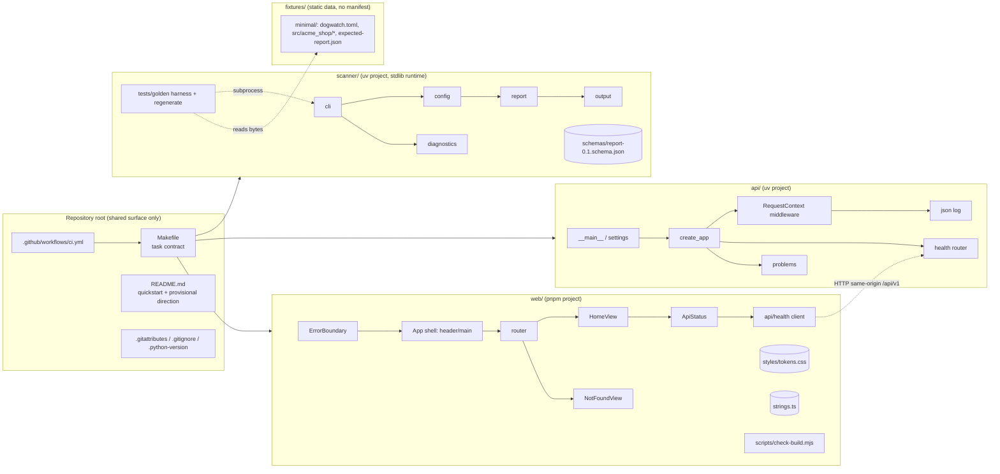
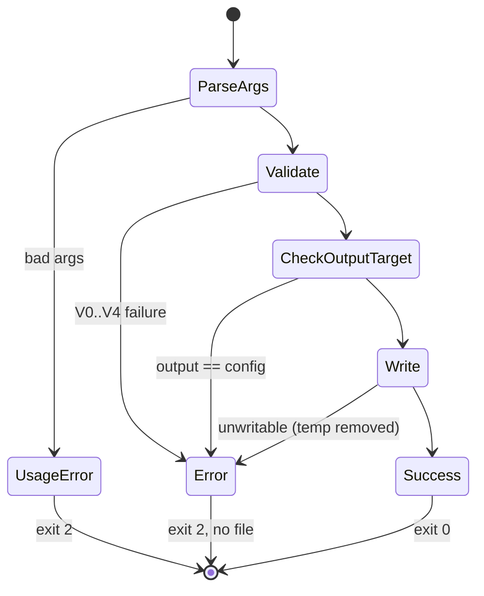

# Architecture — CD-5: Bootstrap the monorepo, scanner CLI, API, web app, and deterministic fixture project

Source of truth: `artifacts/planning/frozen_spec.md` (hereafter "FS"). Prior decisions this design binds to:
- CD-2 (report lifecycle, trust boundary): `/Users/iliaglushkov/Documents/sandbox/contractor/.am/reports/9c37b285-b35d-4dc2-be1c-2347272422e0-research-paper.md` §2.2–§2.5
- CD-3 (policy file, package declaration, diagnostics): `/Users/iliaglushkov/Documents/sandbox/contractor/.am/reports/7ee72c98-20e3-41ff-9321-386775b7a72e-research-paper.md` §2.1, §2.2, §2.12
- CD-4 (finding envelope, fixture matrix): `/Users/iliaglushkov/Documents/sandbox/contractor/.am/reports/5b28548a-4c88-4600-b7cc-a6df1df95c7b-research-paper.md` §2.5, §2.6

Workspace state I checked: the repository holds only `.am/` (platform-managed, read-only for CD-5, FS FR-007) and `.playwright-mcp/` (to be ignored). It has one commit (`4ab1bdc`) and no source, manifests or constitution file. This is a greenfield design. With no constitution file, the binding principles are the FS requirements plus the CD-2/CD-3 ADR invariants (no execution of analysed code, untrusted report rendering, stable public names).

---

## 1. Summary

CD-5 sets up the empty foundation for Dogwatch as **four independently runnable areas in one repository, sharing no runtime**. There is no product logic (FS A-7):

- `scanner/`: the `dogwatch` CLI. Its runtime uses only the standard library.
- `api/`: `dogwatch-api`, a stateless FastAPI process.
- `web/`: a static React SPA rendered client-side (CSR).
- `fixtures/`: static fixture projects with golden reports.

Each code area is its own toolchain island, with its own manifest and lockfile (FS FR-002/FR-003). Python areas are separate `uv` projects, deliberately **not** a uv workspace. The web area is a `pnpm` project.

A root `Makefile` is the only shared surface: one target per documented action (FR-005). GitHub Actions calls those same targets (FR-089), so a local pass and a CI pass mean the same thing.

The scanner has one real behaviour: a filesystem-only validation pipeline for the minimal `dogwatch.toml` (FR-013/FR-013a), followed by a canonical, byte-deterministic `schema_version: "0.1"` report with an empty `findings` array, written atomically (FR-020–FR-026). A golden-file test protects it on Linux and macOS at the oldest and newest supported CPython versions (FR-032, FR-086).

Every deploy, persistence, auth, observability-backend, secrets, rollout and IaC topic is recorded as **provisional direction** in the README and not built (FR-090, A-11). Each one stays in this architecture as a named target, so later tickets have a fixed contract to land on.

---

## 2. Technology Choices

A-2 lists the stack as "provisional until the architect stage confirms". This section confirms it, with the exceptions called out below.

### 2.1 Toolchain and pins (FS FR-006, FR-009, A-2, A-3)

| Concern | Choice | Pin location | Binding |
|---|---|---|---|
| Scanner CPython support range | **3.11 → newest final minor**. As of 2026-10-03 that means **3.11, 3.12, 3.13, 3.14**. 3.15.0 final is scheduled for 2026-10-09 (python.org 3.15.0rc3 announcement). It is added to the matrix only if it has a final release when the scanner work starts, and only if dev tools resolve for it (§7 OQ-2). | `scanner/pyproject.toml` `requires-python = ">=3.11"`; classifiers | FR-009, SC-012 |
| Pinned development/API CPython | **3.14.x**, full patch version, which is inside the scanner range | root `.python-version`; `api/pyproject.toml` `requires-python = "==3.14.*"` | FR-006 |
| Python environment and lock manager | **uv 0.12.x** | `[tool.uv] required-version` in each `pyproject.toml`; CI reads the same value through `setup-uv` `version-file` | FR-006, FR-087 |
| Python format and lint | **ruff**, with `target-version = "py311"` for the scanner and `"py314"` for the API | each `pyproject.toml` | A-2, AS-3.2 |
| Python type check | **mypy --strict**. The scanner sets `python_version = "3.11"` and is type-checked on the 3.11 matrix entry. | each `pyproject.toml` | FR-086, AS-3.6 |
| Python tests | **pytest**, with `--strict-markers` | each `pyproject.toml` | A-2 |
| Node runtime | **Node 24.x LTS** | `web/.node-version`, `package.json` `engines.node` | FR-006 |
| JS package manager | **pnpm 11.x** | `package.json` `packageManager` | FR-006, A-2 |
| Root task runner | **make** (GNU or BSD), which comes preinstalled on macOS and Linux | `Makefile` | A-2, FR-005 |
| Supported developer OS | macOS and Linux. Windows is not supported, and the README says so. | README | A-3 |

Node 26 becomes LTS in late October 2026. We stay on 24 because it is the Active LTS on the implementation date. Bumping Node is a separate change.

### 2.2 Scanner (FS §3.2, §3.3)

- **Runtime dependencies: none.** The scanner uses only the standard library: `argparse`, `tomllib` (which is why the floor is 3.11, FR-009), `hashlib`, `json`, `os`, `tempfile` and `importlib.metadata`.
  - *Why:* no third-party code on customer machines (CD-2 §2.4), no network access or telemetry (FR-063), and nothing that resolves differently across 3.11–3.14 (FR-024).
- **Build backend:** `uv_build`. It reuses the uv toolchain, so no extra build tool is needed (the plan's new-dependency rule).
- **Dev-only dependencies:** `pytest`, `mypy`, `ruff`, and `jsonschema` (Draft 2020-12 validator for FR-025).

### 2.3 API (FS §3.5–§3.11)

- **FastAPI + uvicorn**, plain `uvicorn` without the `[standard]` extra (A-2). FastAPI emits OpenAPI 3.1 by default, which satisfies FR-042 with no extra code.
- **Settings:** read from `os.environ` with the `DOGWATCH_API_` prefix (FR-091). We do not add `pydantic-settings`, because two variables don't justify a dependency.
- **Logging:** stdlib `logging` with a small JSON formatter, writing to stdout (FR-060).
  - *Why stdlib:* the OpenTelemetry logs bridge (FR-062 direction) attaches to stdlib `logging` handlers. This choice lets that later ticket add it without rewriting call sites.
- **Dev dependencies:** `pytest`, `httpx` (for FastAPI `TestClient`), `mypy`, `ruff`.
- **Load-test tool (acceptance only): Locust**, in an *opt-in* uv dependency group `bench`. It is installed only by `make bench-api`, so `make install` and CI installs stay lean.
  - *Why Locust:* SC-006 calls for "an HTTP load generator", and the bundle rubric requires a named tool. Locust is Python, so it locks in `api/uv.lock` and needs no new binary toolchain. It also reports p50/p95/p99 headlessly (`--headless --csv`).
  - *Rejected:*
    - k6: a separate binary toolchain outside the pinned set (FR-006).
    - wrk: no p95 without Lua scripting.
    - Vegeta: models a fixed rate, not concurrent clients.

### 2.4 Web (FS §3.12)

| Concern | Choice | Binding |
|---|---|---|
| Language | TypeScript, `strict: true` | A-2 |
| UI library | **React 19**, about 60 KB gzip for react + react-dom, which leaves room under the 100 KB budget | A-2, FR-074 |
| Build and dev server | **Vite 8**, static SPA (`appType: "spa"`, which serves `index.html` for unknown paths in dev and preview) | FR-071, edge case "deep link" |
| Build target | `browserslist` in `package.json` is the single source. `build.target` and `build.cssTarget` are derived from it through **`browserslist-to-esbuild`**, because Vite's target option does not read browserslist. | FR-070 (dev-only dependency added, with justification) |
| Router | **None (no router library).** A `pathname → view` switch, because there are two views (FR-072). This keeps the bundle small and avoids a dependency. Later views are added with `React.lazy` (FR-074). | FR-072, FR-074 |
| State | View-local `useState`/`useEffect` only. No global store and no data-fetching library. | FR-073 |
| Tests | **Vitest** + Testing Library + jsdom + **axe-core** | A-2, FR-079 |
| Lint and format | **ESLint** (flat config; `typescript-eslint`, `react-hooks`, `jsx-a11y`) + **Prettier** + **stylelint** with `stylelint-declaration-strict-value` | A-2, FR-078 (dev-only dependency added, with justification: ESLint cannot lint CSS values) |
| Fonts and assets | System font stack. No external origins. | FR-075 |

### 2.5 Storage, message bus, background execution

None. FS FR-055 (no database), FR-058 (no workers, queues or events), FR-059 (no rate limiting).

### 2.6 CI

**GitHub Actions** (FR-085). The repository remote is `github.com/Ilya-g-png/contractor`. Actions used:
- `actions/checkout`
- `astral-sh/setup-uv`
- `actions/setup-node`
- `pnpm/action-setup`

Each one is pinned to a full 40-character commit SHA with a `# vX.Y.Z` comment (FR-088).

---

## 3. Component Decomposition



### 3.1 Root (shared surface)

| Component | Responsibility | Owns | Boundary rule |
|---|---|---|---|
| `Makefile` | One target per action (FR-005): `install[-area]`, `test[-scanner\|-api\|-web\|-fixtures]`, `lint[-area]`, `format[-area]`, `build-web`, `run-scanner\|run-api\|run-web`, `regen-fixtures`, `bench-api` | The command contract | Each target `cd`s into one area and calls only that area's tool (`uv run --locked …` / `pnpm run …`). No target installs another area's dependencies (FR-002, AS-1.2–1.4). |
| `README.md` | Quickstart, ≤ 80 lines (SC-010): pinned prerequisites, every command in FR-005, per-area run commands, the scanner's CPython range, defaults, the provisional-direction block (FR-046/057/062/082/090/092/093), the branch-protection recommendation and the recovery runbook (FR-097/098) | Documentation | Every deploy-related line is labelled **provisional** (FR-090). |
| `.gitattributes` | `* text=auto eol=lf`, `fixtures/** text eol=lf` | Byte stability of fixtures and goldens | FR-008 |
| `.gitignore` | `.venv/`, `node_modules/`, `dist/`, caches, `.env`, `.env.*`, `!.env.example`, `.playwright-mcp/` | — | Must **not** list `.am/` (FR-007). |
| `.github/workflows/ci.yml` | Pipeline topology (§6.17) | CI definition | Invokes only Makefile targets (FR-089). |

### 3.2 Scanner (`scanner/`, Python package `dogwatch`)

| Module | Responsibility | Data owned |
|---|---|---|
| `cli` | argparse: `dogwatch --version`, `dogwatch check [--config] [--output]`. Runs the pipeline and maps errors to exit codes (FR-010–FR-012, FR-015). | — |
| `diagnostics` | The `DiagnosticId` catalogue (`config-invalid`, `config-not-found`), the `DogwatchError` carrying one or more diagnostics, and stderr formatting `dogwatch:<id>: <message>` (FR-016) | Diagnostic catalogue (CD-5 subset of CD-3 §2.12 plus the new `config-not-found`) |
| `config` | Staged validation V0–V4 (§4.1), producing an immutable `PolicyConfig`. **Only** calls filesystem metadata (`lexists`, `isdir`, `realpath`). It never opens, parses or imports any file under a package directory (FR-013a, FR-014). | Policy file subset |
| `report` | `build_report(PolicyConfig, version)` and `serialize_canonical(obj) -> bytes` (FR-020–FR-024) | Report envelope |
| `output` | Atomic write: a temp file in the target's directory, then `fsync`, then `os.replace`; the temp file is removed on any failure. Writes stdout through `sys.stdout.buffer` for `--output -`. Rejects output == config before any write. (FR-015, edge cases) | — |
| `schemas/report-0.1.schema.json` | Strict JSON Schema, Draft 2020-12, `additionalProperties: false` at every level, `findings.items: false` (FR-025, FR-026) | Report contract v0.1. Immutable after merge (FR-056). |
| `tests/golden/` (fixture harness) | Discovers `fixtures/*/dogwatch.toml`, runs the CLI as a subprocess, compares bytes and prints a `difflib` unified diff (FR-032). `regenerate.py` is the **only** writer of golden files (FR-034). Selected by the pytest marker `golden`. | — |

The golden harness lives inside the scanner's uv project because `fixtures/` has no manifest (FS §4, Area row). Running it with the marker keeps `test-scanner` and `test-fixtures` as separate commands and separate CI statuses (AS-3.1).

### 3.3 API (`api/`, Python package `dogwatch_api`)

| Module | Responsibility |
|---|---|
| `settings` | Reads `DOGWATCH_API_HOST` (default `127.0.0.1`) and `DOGWATCH_API_PORT` (default `8000`, 1–65535). An invalid value exits `1` with a message naming the variable (FR-044, FR-091). |
| `__main__` | Binds the socket itself, so it fails fast on `EADDRINUSE` with a message naming the port and `DOGWATCH_API_PORT`, and never falls back to another port (edge case). Then runs `uvicorn.Server` on that socket with `access_log=False`. |
| `app.create_app()` | App factory: `openapi_url="/api/v1/openapi.json"`, `docs_url=None`, `redoc_url=None` (the docs UIs load CDN scripts, which conflicts with FR-075's posture). Mounts the health router under `/api/v1`. Registers the problem handlers. |
| `health` | `GET /api/v1/health` → `HealthStatus` (FR-040) |
| `problems` | RFC 9457 builder. Active and reserved code constants. Handlers for `StarletteHTTPException` (404/405) and `RequestValidationError` (422) (FR-050/051). |
| `middleware.RequestContext` | A **pure ASGI** middleware, outermost. It validates or generates `X-Request-ID`, injects it into `http.response.start`, times the request, emits exactly one log line, and turns any unhandled exception into a `500 internal-error` problem when the response has not started. It is pure ASGI because Starlette's `ServerErrorMiddleware` sits outside user middleware, so a 500 handled there would lose the header and the log line (AS-4.4, FR-061). |
| `log` | JSON formatter for stdlib `logging` (§6.9) |

The API owns no data (FR-055).

### 3.4 Web (`web/`)

| Component | Responsibility |
|---|---|
| `index.html` | `lang="en"`, one module `<script src>`, no inline script or handlers (FR-075, FR-079, FR-080) |
| `main.tsx` | Mounts `<ErrorBoundary><App/></ErrorBoundary>` |
| `ErrorBoundary` | Class component. Its fallback is a static "Something went wrong" with a reload button (FR-076). |
| `App` | Shell: `<header>` (product name) and `<main>` (the current view) (FR-079) |
| `router.ts` | `resolveView(pathname)`: `/` → Home, anything else → NotFound (FR-072) |
| `HomeView` / `NotFoundView` | One `h1` each. NotFound links to `/` (AS-5.3). |
| `ApiStatus` | State machine in §4.6. A polite live region (`role="status"`) (FR-073, FR-079 SC 4.1.3). |
| `api/health.ts` | `fetchHealth(baseUrl, signal)` (§5, edge E6). Owns the API consumption contract. |
| `strings.ts` | Every user-visible string (FR-080) |
| `styles/tokens.css` | Every color, spacing, type and radius token on `:root`, light theme only (FR-078) |
| `scripts/check-build.mjs` | Post-build gate: JS and CSS budgets plus no inline script (FR-074, FR-075, AS-5.4) |

### 3.5 Fixtures (`fixtures/`)

`fixtures/README.md` documents the layout convention (FR-033): `fixtures/<kebab-name>/` contains `dogwatch.toml`, its source tree, and `expected-report.json`.

`fixtures/minimal/` declares the package `acme_shop` with root `src`, and contains `src/acme_shop/{__init__,orders,payments}.py` (FR-030).

The fixtures are static data: never installed, imported or executed (FR-031).

### 3.6 Ownership boundaries

- No code area imports from another (FR-003).
- The scanner reads `fixtures/` only as bytes and directory metadata. Only the golden harness reads `expected-report.json`, and only `regenerate.py` writes it.
- The web app knows the API only through the HTTP contract in §5 and stubs it in tests (A-8).
- `.am/` is never written (FR-007).

---

## 4. Data Model

There is no persistence (FR-055). Every entity is an in-memory value or a file contract. Names follow FS §4.

### 4.1 Policy file (`dogwatch.toml`, CD-5 subset of CD-3 §2.1–§2.2)

Shape:

```toml
[python]

[[python.packages]]
name = "acme_shop"   # single identifier (CD-3 §2.2)
root = "src"         # relative to this file's directory
```

Validation pipeline. It stops at the first failing **stage**. Within V4 every failure is reported, one stderr line each.

| Stage | Rule | On failure (exit `2`, no file written) |
|---|---|---|
| V0 exists | `os.path.lexists(config_arg)` | `dogwatch:config-not-found: <path> does not exist` (FR-016) |
| V1 read | Regular file, readable, valid UTF-8 | `dogwatch:config-invalid: <path> is not a readable file` / `… is not valid UTF-8` |
| V2 parse | `tomllib.loads`. Line from `exc.lineno` (3.14+) or parsed from the message `at line N` (3.11–3.13). | `dogwatch:config-invalid: <path>:<line>: invalid TOML: <msg>` (AS-2.5) |
| V3 shape | Top-level keys are exactly `{python}`; `python` keys are exactly `{packages}`; `packages` is a non-empty array of tables; each table's keys are exactly `{name, root}`, both strings; `name.isidentifier()` | `config-invalid: <dotted.key> is not supported in this version` for any extra table or key, which covers `python.rules`, waivers and `openapi` (FR-013). Also "requires at least one [[python.packages]] entry" and type errors. |
| V4 structure | `P_i = config_dir / root_i / name_i` must be an existing directory. No two entries may share the same `name` with the same `realpath(root)` (duplicate). No two entries may share the same `name` with different roots (split). No `realpath(P_j)` may lie inside `realpath(P_i)` for i ≠ j (nested). | `config-invalid` naming the package(s) and `root/name` exactly as declared (FR-013a, SC-013) |

Valid, not errors: a package directory with zero `.py` files (AS-2.7), and a directory without `__init__.py` (a PEP 420 portion, CD-3 §2.2).

In-memory types:
- `PackageDecl(name: str, root: str)`
- `PolicyConfig(path_arg: str, raw: bytes, packages: tuple[PackageDecl, ...])`

Both are frozen dataclasses.

### 4.2 Report (bootstrap envelope, `schema_version` `"0.1"`)

| Field | Type / constraint | Value in CD-5 | Binding |
|---|---|---|---|
| `schema_version` | `const "0.1"` | `"0.1"` | FR-020, FR-021 |
| `scanner.name` | `const "dogwatch"` | `"dogwatch"` | FR-012 |
| `scanner.version` | SemVer 2.0.0, no leading `v` | from `importlib.metadata.version("dogwatch")`, which is `0.1.0` | FR-012, CD-2 §2.3 |
| `policy.path` | Non-empty, no `/` or `\`, no control characters | basename of the config path: `"dogwatch.toml"` | FR-022 |
| `policy.digest.sha256` | `^[0-9a-f]{64}$` | SHA-256 of the raw config bytes | FR-023 |
| `findings` | array, `items: false` | `[]` | FR-020, FR-026 |

- **Excluded by design:** every volatile CD-2 provenance field (`commit_sha`, `object_format`, `dirty`, `base_sha`, `evaluation_date`, `scan_started_at`, `scan_finished_at`, `report_id`) (FR-020).
- **Canonical serialization** (FR-024):
  - `json.dumps(obj, sort_keys=True, indent=2, ensure_ascii=False, separators=(",", ": ")) + "\n"`
  - encoded as UTF-8 with no BOM
  - written as **bytes**, so there is no newline translation
- **Excluded inputs.** None of the following feed the report: time, timezone, locale, cwd, environment, hostname, absolute paths, or the iteration order of the filesystem or dictionaries (sorted keys; the report contains no package listing).

### 4.3 Report JSON Schema

There is one file per published `schema_version`: `scanner/schemas/report-<ver>.schema.json`. `0.1` is never edited after merge (FR-056). It uses `$id: "urn:dogwatch:schema:report:0.1"` and Draft 2020-12.

### 4.4 Diagnostic and scanner run outcome

- `Diagnostic { id ∈ {config-invalid, config-not-found}, message: str }`. Every diagnostic maps to exit `2` (FR-052).
- Run outcome:



`gate-failed` (exit `1`) is reserved and has no transition in CD-5 (FR-015).

### 4.5 Health status and problem detail (API)

- `HealthStatus { status: Literal["ok"], service: Literal["dogwatch-api"], version: str }` (FR-040). This is a pydantic model, so it appears in the OpenAPI document.
- `ProblemDetail { type: "urn:dogwatch:problem:<code>", title: str, status: int, detail: str, code: str }`, served as `application/problem+json` (FR-050).
  - A URN is used because RFC 9457 allows non-dereferenceable URIs, and it avoids inventing a domain the project doesn't own.

### 4.6 API status indicator (web view state)

`checking → available | unavailable`, terminal until reload (FS §4).
- `available` iff all of: `res.ok`, `await res.json()` succeeds, and `body.status === "ok"`.
- `unavailable` for every other outcome: a non-2xx response, a non-JSON body, `status ≠ "ok"`, a network error, or the 5 s timeout.
- A resolution that arrives after a terminal state is ignored (edge case "late success").

### 4.7 CI check

`queued → running → passed | failed | cancelled`. `cancelled` happens only through `concurrency.cancel-in-progress` (FR-088).

### 4.8 Configuration variables

| Variable | Area | Default | Secret? |
|---|---|---|---|
| `DOGWATCH_API_HOST` | api | `127.0.0.1` | no |
| `DOGWATCH_API_PORT` | api | `8000` | no |
| `VITE_DOGWATCH_API_BASE_URL` | web (build-time) | `/api/v1` | no |
| `UV_PYTHON` | scanner (CI matrix / local) | unset, so `.python-version` applies | no |

These are documented in `api/.env.example` and `web/.env.example` (FR-091, FR-073a).

---

## 5. Interaction Topology

There are no asynchronous edges: no queues, pub/sub, schedulers or webhooks (FR-058). Every edge is a synchronous process call, a filesystem access, or a single HTTP request.

| # | Edge | Pattern | Failure semantics |
|---|---|---|---|
| E1 | Developer / CI → `make <target>` → area tool | Synchronous child process | Non-zero exit propagates. `make` stops at the first failure. In CI the job step fails, so its status is red (AS-3.2). |
| E2 | `make install-*` → PyPI / npm / python-build-standalone | Synchronous download, **public registries only** (A-4) | `uv sync --locked` and `pnpm install --frozen-lockfile` fail hard when the lock is stale (FR-087). No credentials are ever requested (SC-011). |
| E3 | `dogwatch check` → filesystem (config read, directory stat) | Synchronous I/O | Mapped to diagnostics V0–V4, exit `2`, nothing written (FR-015). |
| E4 | `dogwatch check` → filesystem (report write) | Atomic: temp file, `fsync`, `os.replace` | On any `OSError`: unlink the temp file, exit `2`, and leave the target untouched (edge case "output not writable"). |
| E5 | Golden harness → `python -m dogwatch check --config <abs> --output <tmp>` | Subprocess, with the environment controlled per variant | Byte mismatch fails with a unified diff (FR-032). A non-zero exit fails with the captured stderr. The harness never writes goldens (FR-034). |
| E6 | Browser → `GET {base}/health` (same-origin `/api/v1`) | One HTTP fetch per mount, `AbortSignal.any([unmountSignal, AbortSignal.timeout(5000)])` | Every failure class leads to `unavailable`. Response text is never rendered (FR-073, FR-073a, CD-2 §2.4). |
| E7 | Vite dev/preview server → API `127.0.0.1:8000` | HTTP reverse proxy for `/api` | API down: the proxy returns 5xx, which E6 maps to `unavailable` (AS-5.2). |
| E8 | API request → stdout | One synchronous JSON log line per request | Logging failures never change the response. A 5xx is logged at `error` level in the same single line (§6.9). |
| E9 | GitHub → Actions workflow → commit status | Event-triggered (`pull_request`, `push` to `main`) | A newer run for the same PR or ref cancels the older one (FR-088). Fork PRs run with a read-only token (AS-3.4). |

No component talks to another component's internals. The web↔API coupling (E6/E7) exists only at runtime. In tests, `fetch` is stubbed (A-8).

---

## 6. Cross-Cutting Concerns

Each subsection matches one of the required bundle sections. Where a topic is *deferred* by the FS, the subsection records the provisional target and the requirement that defers it.

### 6.1 API surface and versioning (`api_surface_and_versioning`)

| Method | Path | Auth | 200 body | Errors |
|---|---|---|---|---|
| GET | `/api/v1/health` | none | `{"status":"ok","service":"dogwatch-api","version":"0.1.0"}` | 405 |
| GET | `/api/v1/openapi.json` | none | OpenAPI **3.1** document | 405 |
| any | anything else | — | — | 404 `not-found` |

- Versioning uses the URL prefix (FR-041). Additive changes (new endpoints, new optional fields) stay in `/api/v1/`. Breaking changes need `/api/v2/`.
- CD-5 adds no ingestion or read endpoints (FR-043).
- The default bind is loopback only (FR-044).

### 6.2 Auth and identity model (`auth_and_identity_model`)

- **CD-5:** both endpoints are unauthenticated. There is no credential handling of any kind (FR-045).
- **Recorded target**, provisional only in timing; the scheme itself is decided by CD-2 §2.2 and FS FR-046:
  - Report uploads authenticate with **GitHub Actions OIDC**: a **JWT** signed RS256, verified against the issuer's **JWKS** by `kid`, with exact issuer, exact Dogwatch audience, `exp`/`nbf`/`iat` checked with ≤ 60 s skew, single-use `jti`, and binding on `repository_id`/`repository_owner_id` (CD-2 §2.3).
  - Alternatively, a **project-scoped upload API key**, stored only as a hash and revocable.
  - Operator authentication is undecided and out of scope.

### 6.3 Auth session and CSRF (`auth_session_and_csrf_model`)

- **CD-5:** no session, no cookies, no state-changing endpoints, so no CSRF surface (FR-082).
- **Recorded target:**
  - Operator **session** cookies are `HttpOnly; Secure; SameSite=Lax` or stricter.
  - Every state-changing request needs a CSRF token or a same-origin custom-header check.
  - The exact mechanism belongs to the auth ticket.

### 6.4 Data model and storage (`data_model_and_storage`)

- §4 covers this. There is no database and no server-side persistence (FR-055).
- The only durable artifacts are files under version control: the schema, fixtures and goldens.

### 6.5 Migration and schema evolution (`migration_and_schema_evolution`)

- **Report schema: expand-contract** (FR-056).
  - Within one major version, changes are additive only: new optional fields, which consumers ignore if unknown.
  - Removing or renaming a field needs a new major version, released after consumers have moved.
  - Each published `schema_version` keeps its own frozen schema file.
  - `0.x` carries no compatibility promise. The `1.0` schema is where CD-2's required provenance set and the expand-contract guarantee start (FR-021, FR-056).
- **Future database: zero-downtime expand-contract migrations**: add, then backfill, then switch reads, then remove in a later release (FR-057). This is recorded in the README only.

### 6.6 Background jobs and scheduling (`background_jobs_and_scheduling`)

- None (FR-058).
- **Recorded target:** CD-2's isolated validation worker with a `pending`/`complete`/`failed` status resource arrives with the ingestion ticket.

### 6.7 Event and messaging contract (`event_and_messaging_contract`)

- None (FR-058).
- The only "event" consumers in CD-5 are GitHub's `pull_request` and `push` triggers for CI (FR-085).

### 6.8 Rate limiting and quotas (`rate_limiting_and_quotas`)

- None (FR-059).
- The `rate-limited` (429) code is reserved.
- **Recorded target** (CD-2 §2.4): per-token and per-project rate limits plus per-project report caps.
- Ingestion size caps are also deferred: 10 MiB compressed, about 50 MiB decompressed, 25,000 findings (FR-094).

### 6.9 Observability and SLO (`observability_and_slo`) and observability stack (`observability_stack`)

**Built in CD-5 (logs only):**
- One JSON line per request to stdout (FR-060):

  ```json
  {"ts":"2026-10-03T12:00:00.123Z","level":"info","event":"request","request_id":"…","method":"GET","route":"/api/v1/health","status":200,"duration_ms":1.42}
  ```

- `route` is the matched route template, or `null` when nothing matched.
- On 5xx the line has `level:"error"` and adds `error_type` and `error_traceback`. The stack trace goes to logs, never to the response body.
- Never logged: request bodies, query strings, or any header value other than the validated request ID.
- `X-Request-ID` handling:
  - The incoming value is echoed if it matches `^[\x20-\x7E]{1,128}$`.
  - Otherwise a `uuid4` is generated, so a raw invalid value is never logged (log injection).
  - The ID is present on every response, including 404, 405 and 500 (FR-061, AS-4.4).
- The scanner emits **no telemetry** (FR-063).

**Recorded target stack (provisional, FR-062/FR-090):**
- **OpenTelemetry** SDK instrumentation for **logs, metrics and traces**, exported over OTLP to an **OpenTelemetry Collector**.
- The Collector forwards **metrics → Prometheus**, **logs → Grafana Loki** and **traces → Grafana Tempo**.
- CD-5's stdlib-logging choice and request-ID propagation are the seams that bridge attaches to.

**SLOs:** CD-5 runs only locally and in CI, so its SLOs are acceptance gates, not production objectives:

| SC | Target | Load-test tool | Load level | Dataset | Environment shape |
|---|---|---|---|---|---|
| SC-006 | `GET /api/v1/health` **p95 ≤ 50 ms, p99 ≤ 100 ms**, 0 errors | **Locust** headless (`-u 20 -r 20 -t 60s --csv`) via `make bench-api` | 20 concurrent clients, sustained 60 s | None (stateless endpoint, 0 stored rows) | One GitHub-hosted `ubuntu-24.04` standard runner; a single uvicorn process with one worker; generator and API on the same host over loopback |

### 6.10 Error taxonomy and codes (`error_taxonomy_and_codes`)

**API** (RFC 9457 `application/problem+json`, FR-050/051):

| `code` | HTTP | CD-5 trigger | Body rule |
|---|---|---|---|
| `not-found` | 404 | Unknown route | Detail names the path only, never the query string |
| `method-not-allowed` | 405 | Known path with the wrong method | Includes an `Allow` header |
| `validation-failed` | 422 | `RequestValidationError`. Tested through a test-only route registered in the tests; no product endpoint is added. | Gives the error count only; no input is echoed |
| `internal-error` | 500 | Any unhandled exception | Fixed text. No stack trace or exception text. |
| `schema-invalid` | 400 | reserved | — |
| `payload-too-large` | 413 | reserved | — |
| `in-flight` | 409 | reserved | — |
| `idempotency-conflict` | 422 | reserved | — |
| `rate-limited` | 429 | reserved | — |

**Scanner** (FR-015, FR-016, FR-052):

| Category | stderr | Exit |
|---|---|---|
| Report written | (empty) | `0` |
| Gate failed | — (reserved, never emitted) | `1` |
| Config missing | `dogwatch:config-not-found: …` | `2` |
| Malformed TOML / unsupported content / package structure | `dogwatch:config-invalid: …` | `2` |
| Usage error | argparse `usage:` and `dogwatch: error: …` | `2` |
| Output unwritable, or output == config | `dogwatch: error: …` (no catalogue ID; see OQ-1) | `2` |

**API process startup:** an invalid setting or a port already in use gives a message naming the variable or port and exit `1`.

### 6.11 Deployment topology and environments (`deployment_topology_and_envs`) and target environments (`target_environments`)

- **Environments that exist in CD-5:** (1) **local development** on macOS and Linux; (2) **CI** on GitHub-hosted `ubuntu-24.04` and `macos-15` runners (FR-090). There is no staging or production.
- **Local topology:**
  - API on `127.0.0.1:8000`.
  - Web dev server on `127.0.0.1:5173` with `strictPort`. It proxies `/api` to `127.0.0.1:8000`, so the browser sees a single origin (FR-073a).
  - `vite preview` serves the production build with the same proxy, for the Lighthouse runs.
- **Recorded direction (provisional, hosting target undecided):** the API ships as an **OCI container image**; the web app ships as **static assets** behind the same origin as `/api/v1` (FR-090).

### 6.12 Container and orchestration model (`container_and_orchestration_model`)

- CD-5 builds and publishes no images (FR-090).
- **Provisional:** the API becomes an OCI image. The orchestrator is undecided and tied to the hosting decision. The README labels it provisional.

### 6.13 Infrastructure as code (`infrastructure_as_code_strategy`)

- No IaC in CD-5 (FR-090).
- **Provisional direction: Terraform.** The provider is chosen with the hosting target in the later deployment ticket.

### 6.14 Scaling and resource limits (`scaling_and_resource_limits`)

- API: a single local process, with no horizontal-scaling design in CD-5 (FR-094).
- Scanner: peak RSS on `fixtures/minimal` must be **≤ 200 MB**. A scanner test asserts it with `resource.getrusage(RUSAGE_CHILDREN).ru_maxrss`, normalising units (bytes on macOS, KiB on Linux) (FR-094).

### 6.15 Secrets and config management (`secrets_and_config_management`) and secrets and credentials management (`secrets_and_credentials_management`)

- **CD-5 needs no secrets** (FR-091).
  - Every setting has a safe default (§4.8).
  - `.env.example` files hold only non-secret examples. `.env` and `.env.*` are git-ignored.
  - CI contains zero `secrets.` references and never uses `pull_request_target` (FR-088, SC-011).
- **Recorded model (provisional product, FR-092):**
  - CI authenticates to cloud resources through **GitHub Actions OIDC** federation, with no long-lived cloud keys stored as repository secrets.
  - Runtime secrets live in the hosting platform's **cloud-provider secret manager** (for example AWS Secrets Manager or GCP Secret Manager).
  - Upload API keys are stored only as hashes (CD-2 §2.2).

### 6.16 Rollout and rollback (`rollout_and_rollback_strategy`)

- **CD-5:** nothing is deployed. Rollback is a **git revert of the merge commit on `main`**, and that revert must pass the same CI (FR-093).
- **Recorded target (provisional):**
  - **Blue-green** releases. Rollback means switching traffic back to the previous colour.
  - A **feature-flag kill-switch** for new ingestion behaviour (FR-093).

### 6.17 CI/CD pipeline topology (`ci_cd_pipeline_topology`)

`ci.yml` (FR-085–FR-089):
- **Triggers:** `pull_request` (branches `[main]`) and `push` (branches `[main]`).
- **Settings:**
  - `permissions: contents: read` at the top level
  - `concurrency: { group: ci-${{ github.event.pull_request.number || github.ref }}, cancel-in-progress: true }`
  - every action pinned by SHA
  - `timeout-minutes: 10` on every job

| Status name | Runner | Matrix | Steps (Makefile targets only) |
|---|---|---|---|
| `scanner (3.11)` … `scanner (3.14)` | ubuntu-24.04 | `python: [3.11, 3.12, 3.13, 3.14]` (plus 3.15 per OQ-2), exported as `UV_PYTHON` | 3.11 entry only: `make lint-scanner` (ruff format check, ruff check, mypy on the floor). All entries: `make test-scanner`. |
| `api` | ubuntu-24.04 | — | `make lint-api test-api` |
| `web` | ubuntu-24.04 | — | `make install-web lint-web test-web build-web` |
| `fixtures (<os>, <py>)` | ubuntu-24.04, macos-15 | os × `[3.11, newest]` | `make test-fixtures` |

- That is 10 statuses with today's range: 4 + 1 + 1 + 4 (AS-3.1).
- Estimated cost is about 15 runner-minutes and about 4 minutes wall-clock. The budget is ≤ 25 runner-minutes and ≤ 10 minutes (FR-095).
- `setup-uv` and `setup-node` caching is keyed on the lockfiles.
- There is no path filtering (A-5).

**Delivery-performance SC (DORA):**

| Metric | Target | Window | Scope | Measurement source |
|---|---|---|---|---|
| Lead time for changes (pre-deployment proxy), SC-005 | median ≤ 10 min, p95 ≤ 15 min from push to `main` until every check is green | first 30 days after merge (rolling) | every push to `main` | GitHub Actions run start/finish timestamps through the Actions REST API (GitHub Actions analytics) |
| Pipeline cost, FR-095 | ≤ 25 runner-minutes and ≤ 10 min wall-clock per run | per run | every PR and every push to `main` | GitHub Actions job timing (Actions API `timing` endpoint) |
| Gate efficacy, SC-004 | 3/3 seeded format violations and 1/1 seeded golden change turn the matching status red | once at acceptance | throwaway PRs | GitHub Actions check-run conclusions |

Deploy frequency, MTTR and change failure rate don't apply until something is deployed (FR-090). They become the delivery vocabulary in the deployment ticket.

### 6.18 Cost and resource budget (`cost_and_resource_budget`)

- Infrastructure cost is **USD 0/month** (FR-095).
- CI is held to ≤ 25 runner-minutes per run.
- macOS is restricted to the fixture job at two CPython versions because of its higher per-minute weight. Whether minutes are billable depends on repository visibility (OQ-6).

### 6.19 Data retention and compliance (`data_retention_and_compliance`) and compliance and audit trails (`compliance_and_audit_trails`)

- No user or report data is stored, and no personal data is processed (FR-096, FR-098).
- CI uploads no artifacts. Logs keep GitHub's default retention.
- The report retention period is a deferred CD-2 question.
- **Audit trail:** git history plus GitHub Actions run logs.
- The README recommends branch protection on `main` that requires every FR-086 status. An admin applies it outside this change (A-10).

### 6.20 Backup and disaster recovery (`backup_and_disaster_recovery`, `disaster_recovery_runbook`)

- The GitHub remote is the system of record. All required state is in the repository (FR-097).
- **Runbook (README):**
  1. `git clone https://github.com/Ilya-g-png/contractor`
  2. Install the pinned prerequisites (make, uv, Node 24, pnpm 11).
  3. `make install`
  4. `make test`. Green means recovered.
- RTO is bounded by SC-001: ≤ 10 minutes on a clean Ubuntu runner or a clean macOS machine.

### 6.21 Target browsers and versions (`target_browsers_and_versions`)

- `package.json` `browserslist`: `["last 2 Chrome versions","last 2 Edge versions","last 2 Firefox versions","last 2 Safari versions","last 2 iOS versions"]`.
- The build target and CSS target are derived from it (FR-070).
- `build.modulePreload.polyfill = false`: every target supports `modulepreload`, and turning the polyfill off removes code from the entry chunk.

### 6.22 Routing and navigation model (`routing_and_navigation_model`)

- Path-based (history) URLs, never hash fragments.
- `/` maps to Home. Every other path maps to Not Found, which has `<a href="/">` back to Home (FR-072).
- No router library (§2.4).

### 6.23 Rendering strategy (`rendering_strategy`)

- **CSR**: a statically built SPA with no server-side runtime for the web app (FR-071).
- *Why:* an authenticated operator tool with no SEO need, and the API stays the only server process.
- SSR, SSG, ISR and RSC are rejected for CD-5.

### 6.24 State management and data fetching (`state_management_and_data_fetching`)

- View-local React state only. No global store and no query cache (FR-073).
- One health request per Home mount. The cleanup aborts it, which also keeps React StrictMode's double effect run in development harmless.

### 6.25 API consumption contract (`api_consumption_contract`)

- Base URL: same-origin `/api/v1`, overridable at build time with `VITE_DOGWATCH_API_BASE_URL` (FR-073a).
- The client reads only the boolean `status === "ok"`.
- No response text is ever rendered. Untrusted data is shown as plain text only (CD-2 §2.4).
- Status strings come from `strings.ts`: "Checking API…", "API available", "API unavailable".

### 6.26 Responsive breakpoints and layout (`responsive_breakpoints_and_layout`)

- Compact `< 640px`, medium `640–1023px`, wide `≥ 1024px`, built mobile-first with `@media (min-width: 640px)` and `(min-width: 1024px)`.
- The layout works from **320 CSS px** with no horizontal scroll, meeting **WCAG 2.2 SC 1.4.10 Reflow** (FR-077).
- Media-query breakpoints are literal values. The stylelint strict-value rule ignores media parameters.

### 6.27 Design tokens and theming (`design_tokens_and_theming`)

- `styles/tokens.css` defines `--color-*`, `--space-*`, `--font-*` and `--radius-*` on `:root`. The light theme is the only one.
- A later dark theme overrides the same names, for example under `[data-theme="dark"]` (FR-078).
- `stylelint-declaration-strict-value` turns literal color, spacing, font-size and radius values outside `tokens.css` into **lint errors**.
- Contrast ratios (≥ 4.5:1) are recorded next to each foreground/background token pair.

### 6.28 Accessibility WCAG level (`accessibility_wcag_level`)

- Target: **WCAG 2.2 Level AA** (FR-079).
- Required:
  - `lang="en"` (SC 3.1.1)
  - a single `h1` per view
  - `header` and `main` landmarks (SC 1.3.1)
  - visible focus outlines from tokens (SC 2.4.7)
  - text contrast ≥ 4.5:1 (SC 1.4.3)
  - the status indicator in a polite live region (SC 4.1.3)
- **SC-009:** 0 axe-core violations for the tags `wcag2a, wcag2aa, wcag21a, wcag21aa, wcag22aa` on Home and Not Found.
  - Tool: axe-core in Vitest with jsdom, on every CI run.
  - Throttling: not applicable (static DOM analysis).
- jsdom cannot evaluate SC 1.4.3 contrast (axe reports it as *incomplete*), so contrast is verified by the Lighthouse accessibility audit at acceptance (OQ-5).

### 6.29 i18n and locale strategy (`i18n_and_locale_strategy`)

- English only, `lang="en"`, no locale switching (FR-080).
- All user-visible strings live in `src/strings.ts`, ready for extraction by a later i18n layer.
- The scanner's output never depends on locale (FR-024; tested with `LC_ALL` variants including `tr_TR.UTF-8`).

### 6.30 Performance budget (`performance_budget`)

| SC | Target | Tool | Throttling profile |
|---|---|---|---|
| SC-007 / FR-074 | **Initial JS for the Home route ≤ 100 KB gzip** (KB = 1000 bytes, the stricter reading); **total CSS ≤ 20 KB gzip** | `check-build.mjs`: gzip level 9 of the entry chunk plus its transitive static imports from `.vite/manifest.json`, and of all `dist/**/*.css`. Runs in the CI `web` job on every run. | n/a (build-time size check) |
| SC-008 | **LCP ≤ 2.5 s, CLS ≤ 0.1, TBT ≤ 200 ms** (lab proxy for **INP ≤ 200 ms**) | **Lighthouse** mobile preset against `vite preview`, median of 3 runs, at acceptance | Lighthouse mobile simulated throttling (**Slow 4G**, **4× CPU slowdown**) |

### 6.31 Analytics and consent model (`analytics_and_consent_model`)

- No analytics, tracking or third-party scripts. No cookies. No `localStorage`/`sessionStorage` (FR-081).
- ESLint `no-restricted-globals` and `no-restricted-properties` ban `document.cookie`, `localStorage` and `sessionStorage`.
- Nothing is collected, so no consent banner is needed.

### 6.32 Error boundary and offline strategy (`error_boundary_and_offline_strategy`)

- A top-level React error boundary shows a static fallback with a reload button (FR-076).
- The API status indicator absorbs network failure (§4.6).
- No service worker and no offline caching (FR-076).

### 6.33 Asset pipeline and code splitting (`asset_pipeline_and_code_splitting`)

- Vite emits content-hashed `assets/[name]-[hash].{js,css}` and `build.manifest: true` (FR-074).
- `check-build.mjs` also fails the build if `dist/index.html` contains a `<script>` without `src` or any `on[a-z]+=` attribute. The app therefore runs under CSP `default-src 'self'` (FR-075).
- No route splitting in CD-5. Later views must use `React.lazy` so the Home budget holds (FR-074).

### 6.34 Determinism (cross-cutting for scanner and fixtures; FR-024, SC-002)

The golden test runs **5 environment variants** per interpreter. Each variant has its own temporary cwd and `HOME`, plus:
- `TZ` ∈ {UTC, America/Los_Angeles, Asia/Kolkata, Pacific/Chatham, Etc/GMT+12}
- `LC_ALL`/`LANG` ∈ {C, C.UTF-8, en_US.UTF-8, tr_TR.UTF-8, POSIX}
- a random `PYTHONHASHSEED`

5 variants × {3.11, newest} = 10 runs per OS. With Linux and macOS that gives the 20 runs SC-002 counts.

### 6.35 Idempotency and caching

- Not applicable in CD-5: there are no writes and no cache layer.
- Idempotency keyed by `report_id` (CD-2 §2.3) arrives with ingestion. Its error codes are already reserved (§6.10).

---

## 7. Open Questions

Each question is non-blocking. A default has been applied so implementation can proceed.

1. **OQ-1. Diagnostic IDs for runtime write errors** (FS FR-016, FR-052).
   - FR-052 maps "output not writable" and "output equals config" to exit `2`.
   - FR-016 authorises only one new ID (`config-not-found`) and requires the `dogwatch:<id>:` form for "diagnostics".
   - *Default:* `dogwatch: error: <message>` with no catalogue ID.
   - *Question:* should CD-3 §2.12 gain an ID such as `dogwatch:output-unwritable`?
2. **OQ-2. Ceiling of the supported CPython range** (FS FR-009).
   - 3.15.0 final is scheduled for 2026-10-09, six days after this design.
   - *Default:* include 3.15 only if it is final when the scanner work starts **and** `uv lock` resolves the dev tools (mypy, ruff, pytest, jsonschema) for it. Otherwise ship with 3.14 as the ceiling and record that.
   - *Question:* please confirm that the dev-tool fallback is acceptable under FR-009's "newest final minor" wording.
3. **OQ-3. Meaning of "one dotted name split across two roots"** (FS FR-013a, CD-3 §2.2).
   - CD-3 makes `name` a single identifier, so a dotted name can't be declared.
   - *Default:* "split" means the same `name` declared under two different roots, and any `name` containing a dot is rejected in V3.
   - *Question:* please confirm.
4. **OQ-4. `policy.path` semantics and envelope shape once provenance arrives** (FS FR-020, FR-022, FR-056).
   - CD-2 §2.3 defines `policy.path` as the *repo-relative* path, and uses it in the report-slot key (project, `commit_sha`, `policy.path`). It also groups provenance in a top-level `provenance` block.
   - FR-022 defines it as relative to the config's own directory, which is always `"dogwatch.toml"`, and FR-020 puts `scanner`/`policy` at the top level.
   - *Default:* follow the FS for `0.1`.
   - *Question:* which ticket decides whether the later schema version changes `policy.path` to repo-relative and/or nests fields under `provenance`? That change is outside expand-contract and needs a major version or a `0.x` step.
5. **OQ-5. Contrast verification on every CI run** (FS FR-079, SC-009).
   - axe in jsdom cannot check SC 1.4.3, so contrast is verified only by Lighthouse at acceptance and by the documented token ratios.
   - *Question:* is acceptance-time verification enough, or should CI add a real-browser axe run (for example Playwright with Chromium)? That would add about 1–2 runner-minutes against FR-095's 25-minute budget.
6. **OQ-6. Repository visibility** (FS FR-085, FR-095, AS-3.4).
   - "USD 0/month" and the fork-PR acceptance check assume a **public** repository, where GitHub-hosted minutes are free and forks are possible.
   - If `Ilya-g-png/contractor` is private, Actions minutes are billed after the free quota, with a macOS multiplier, and the fork-PR check needs forking to be enabled.
   - *Question:* please confirm whether the repository is public or private.
7. **OQ-7. Exit code for `config-invalid` in later CD-4 work** (FS FR-015, FR-052, A-13).
   - CD-4 §2.6 fixture F8e expects `dogwatch:config-invalid` to exit **1**. FS FR-015/FR-052 fix it at **2**.
   - A-13 lists only the `schema` → `schema_version` and `config-not-found` follow-ups.
   - *Question:* should A-13 also record that CD-4 implementation must use exit `2` for `config-invalid`?
8. **OQ-8. Fixture convention for git-history fixtures** (FS FR-033, A-6).
   - CD-4 §2.6 fixtures need a baseline at a fixture-repo tag `base`. Fixtures embedded in the monorepo can't carry their own tags or history.
   - *Default:* the CD-5 convention (one directory per fixture with config, sources and golden) stands.
   - *Question:* should a later fixture build its git history at test time (for example, initialising a temp repo from `base/` and `candidate/` subdirectories)? If so, the FR-033 convention needs that optional sub-layout recorded before CD-4 starts.
