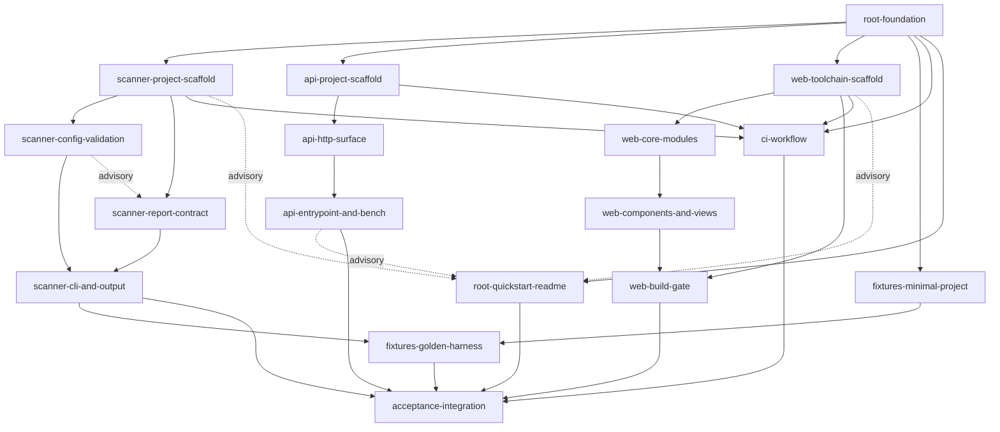

# Decomposition — CD-5: Bootstrap the monorepo, scanner CLI, API, web app, and deterministic fixture project

**Inputs:**
- `planning/frozen_spec.md` ("FS"): the authoritative source.
- `design/architecture.md` ("ARCH").
- `design/architecture_contracts.md` ("AC").
- `design/ui_specification.md` ("UI").
- `design/component_contracts.md` ("CC").
- `plan/plan.json` (EPIC-001…EPIC-006).

**Where the plan disagrees with the design:** the precedence used is ARCH > AC > plan, as AC itself states. For web copy, the component contracts (CC) override AC. Every override is listed in §5.

**Workspace check:** the repository holds only `.am/` (platform-managed, never written), `.playwright-mcp/` (to be git-ignored) and commit `4ab1bdc`. No source, manifests or lockfiles exist yet, so this is a greenfield decomposition.

---

## 1. Summary

CD-5 lays the empty foundation for Dogwatch with no product logic (FS A-7). It creates four independently runnable areas:
- `scanner/`: the stdlib-only `dogwatch` CLI.
- `api/`: the stateless `dogwatch-api` FastAPI service.
- `web/`: a static React CSR single-page app.
- `fixtures/`: static fixture projects with golden reports.

Around them it adds a root `Makefile` task contract, a quickstart README of at most 80 lines, and a GitHub Actions workflow that calls only Makefile targets.

**How the work is split.** Units follow ARCH §3 ownership boundaries, which are also the toolchain boundaries: one area per lane, with exclusive write scopes. Inside each area, units follow the area's internal module seams, so every unit fits in one developer session and cross-unit interaction goes only through a named contract (AC IC-/DC- IDs).

**Seam rules:**
- **Scaffold-first rule:** each code area's first unit (`*-scaffold`) is the only unit that writes that area's manifest and lockfile. It installs every dependency the area will ever need in CD-5, so later units never touch `pyproject.toml`, `uv.lock`, `package.json` or `pnpm-lock.yaml`. This removes the most common merge conflict in parallel lanes.
- **Makefile ownership:** the root `Makefile` is written once and in full by `root-foundation`, following AC IC-2. After that, only `acceptance-integration` may amend it, and only to fix contract drift.

**Size and mapping:** 17 units, grouped under the six plan epics so the downstream `DeveloperTaskPlan` keeps the epic structure:

| Epic | Units |
|---|---|
| EPIC-001 | `root-foundation` |
| EPIC-002 | `scanner-*` (4 units) |
| EPIC-003 | `api-*` (3 units) |
| EPIC-004 | `web-*` (4 units) |
| EPIC-005 | `fixtures-*` (2 units) |
| EPIC-006 | `ci-workflow`, `root-quickstart-readme`, `acceptance-integration` |

---

## 2. Implementation Units

Conventions used in every unit:
- **Owns:** files this unit exclusively creates or edits.
- **Must not touch:** explicit exclusions.
- Success criteria are testable predicates. Each one names the AC invariant or interface it proves.
- Every unit also inherits: never write `.am/**` (FS FR-007, AC INV-A4), and never add a Dockerfile, `*.tf`, database driver, queue client or rate-limit library (AC INV-R1).

### EPIC-001 — Root foundation

#### U1 `root-foundation` — Root ignore and attribute rules, Python pin, and the full Makefile task contract

- **FS:** FR-001, FR-005, FR-006 (`.python-version`), FR-007, FR-008, FR-089 (the command contract CI will reuse); supports SC-001, SC-003, SC-010.
- **ARCH:** §3.1 Root (Makefile, `.gitattributes`, `.gitignore`, `.python-version`); §2.1 toolchain pins. **AC:** IC-2, INV-A4, INV-F1, VC-10, VC-12.
- **Owns:**
  - `/Makefile`
  - `/.gitignore`
  - `/.gitattributes`
  - `/.python-version`
- **Write-scope hints:**
  - Makefile targets and commands must match AC IC-2 character for character: `install[-scanner|-api|-web]`, `test[-scanner|-fixtures|-api|-web]`, `lint[-…]`, `format[-…]`, `build-web`, `run-scanner|run-api|run-web`, `regen-fixtures`, `bench-api`.
  - `bench-api` uses Locust, per AC IC-2 and ARCH §2.3. This **overrides** the plan's httpx script (AC G-1).
  - Every recipe runs `cd <area> && …`. Declare all targets `.PHONY`. Do not use GNU-only functions, because the Makefile must also run under BSD make on macOS. Pass `UV_PYTHON` through unchanged.
  - Pin `.python-version` to a full `3.14.<patch>`.
  - `.gitignore`: `.venv/`, `node_modules/`, `dist/`, tool caches, `.env`, `.env.*`, `!.env.example`, `.playwright-mcp/`. It must have **no** `.am` line.
  - `.gitattributes`: `* text=auto eol=lf` and `fixtures/** text eol=lf`.
- **Must not touch:** any area directory.
- **Success criteria:**
  1. `make -n test`, `make -n lint`, `make -n format`, `make -n install` and `make -n build-web` each exit `0` under GNU make and under `/usr/bin/make` on macOS. Each prints exactly the AC IC-2 commands, in the order scanner, fixtures, api, web.
  2. `git check-attr eol -- fixtures/any/x.py` returns `lf` (INV-F1 precondition).
  3. `git check-ignore .playwright-mcp/x` matches. `git check-ignore .am/x` does not match. `git diff --name-only -- .am/` is empty (INV-A4).
  4. `.python-version` is a single line matching `^3\.14\.\d+$`.
  5. No target recipe invokes a tool from another area. For example, no `uv` appears in a `*-web` recipe and no `pnpm` in a scanner or api recipe (FR-002).

### EPIC-002 — Scanner (`scanner/`, Python package `dogwatch`)

#### U2 `scanner-project-scaffold` — Scanner uv project, toolchain config, diagnostics catalogue, test scaffolding

- **FS:** FR-002, FR-003, FR-006, FR-009, FR-016 (catalogue), FR-063 (no runtime dependencies), FR-087; SC-012.
- **ARCH:** §2.1, §2.2, §3.2 `diagnostics`. **AC:** DC-4, VC-3, VC-12, INV-A3, INV-S2 (the "no runtime dependencies" half), INV-C8.
- **Owns:**
  - `scanner/pyproject.toml`
  - `scanner/uv.lock`
  - `scanner/src/dogwatch/__init__.py`
  - `scanner/src/dogwatch/py.typed`
  - `scanner/src/dogwatch/diagnostics.py`
  - `scanner/tests/__init__.py` (empty)
  - `scanner/tests/conftest.py` (fixtures `repo_root` and `make_config(tmp_path, toml_text, dirs=…)`)
  - `scanner/tests/test_diagnostics.py`
  - `scanner/tests/test_isolation.py` (INV-A1)
- **Write-scope hints:**
  - `[project]`:
    - name `dogwatch`, version `0.1.0`
    - `requires-python = ">=3.11"`
    - `dependencies = []`
    - classifiers for 3.11–3.14
    - `[project.scripts] dogwatch = "dogwatch.cli:main"`, where `cli` is provided by U5
    - build backend `uv_build`
  - `[tool.uv] required-version` set to 0.12.x.
  - Dev group: `pytest`, `ruff`, `mypy`, `jsonschema`.
  - `[tool.ruff] target-version = "py311"`.
  - `[tool.mypy] strict = true`, `python_version = "3.11"`, with files configured so that a bare `mypy` checks `src` and `tests`.
  - `[tool.pytest.ini_options]`: `addopts = "--strict-markers"`, with the marker `golden` **pre-registered**. This is the seam for U14.
  - `uv.lock` must resolve across the whole range from 3.11 to the ceiling (FR-087). The ceiling follows OQ-2/R-1: add 3.15 only if it is final when this unit starts and the dev tools resolve on it.
  - `diagnostics.py`:
    - `DiagnosticId = Literal["config-invalid", "config-not-found"]`
    - frozen `Diagnostic(id, message)`
    - `DogwatchError(diagnostics: tuple[Diagnostic, ...])`, which requires at least one entry
    - `render(err) -> str`, exactly per DC-4
    - the exit-code constants `EXIT_OK = 0`, `EXIT_GATE_FAILED = 1` (reserved), `EXIT_ERROR = 2`
- **Must not touch:** `scanner/tests/golden/**` (owned by U14), and the other `src` modules (U3–U5).
- **Success criteria:**
  1. `make install-scanner` and `make lint-scanner` pass in a clean clone that has only uv.
  2. `UV_PYTHON=3.11 make test-scanner` and `UV_PYTHON=3.14 make test-scanner` both pass (diagnostics plus isolation tests).
  3. `test_diagnostics` asserts that rendering two diagnostics gives two lines, each matching `^dogwatch:(config-invalid|config-not-found): .+$`, with a trailing `\n`.
  4. `test_isolation` (INV-A1) asserts that no file under `scanner/src` imports `dogwatch_api`, and that `[project].dependencies == []`.
  5. `pyproject.toml` contains `requires-python = ">=3.11"`, `--strict-markers` and a registered `golden` marker. `scanner/tests/golden/` does not exist.

#### U3 `scanner-config-validation` — Staged policy-file validation V0–V4 producing `PolicyConfig`

- **FS:** FR-013, FR-013a, FR-014, FR-016, FR-052; SC-013; Edge Cases: missing config, malformed TOML, unsupported content, empty config, missing or non-directory package, duplicate/nested/split packages, zero `.py` files, no `__init__.py`.
- **ARCH:** §3.2 `config`, §4.1. **AC:** DC-1, DC-2, INV-S1 (filesystem-call allowlist), INV-S6 (unit half), VC-9; G-3 and G-7 defaults.
- **Owns:**
  - `scanner/src/dogwatch/config.py`
  - `scanner/tests/test_config.py`
- **Write-scope hints:**
  - Public API: `load_policy(config_arg: str) -> PolicyConfig`. It raises `DogwatchError` and is pure apart from reading the config file and making metadata calls.
  - Types: frozen `PackageDecl(name, root)` and `PolicyConfig(path_arg, raw, packages)`.
  - Stage behaviour:
    - Stages stop at the first failure.
    - V4 collects every failure, in the order DC-1 defines (V4a per entry, then V4b over pairs `i<j`).
    - V2 line number: use `exc.lineno` when present, otherwise the regex `at line (\d+)`, otherwise `?`.
    - V3 unknown keys: report only the first, in sorted dotted-key order, using `[i]` for array indexes.
    - Reject names that are not single identifiers (OQ-3 default).
    - Decode as `utf-8`, not `utf-8-sig`. A BOM therefore fails as invalid TOML (G-7).
  - V4 may call **only** `os.path.lexists`, `os.path.isdir` and `os.path.realpath`.
- **Must not touch:** `cli.py`, `report.py`, `output.py`, `pyproject.toml`.
- **Success criteria:**
  1. Every DC-1 stderr template has a test asserting the diagnostic id and every named placeholder value, never the interpreter's own message text. Cases:
     - V0 missing path
     - V1 directory-as-config and invalid UTF-8
     - V2 malformed TOML with the correct line, on 3.11 and 3.14
     - V3: `[[python.rules]]`, `[openapi]`, `python.packages[0].include`, empty file, missing `packages`, wrong types, dotted name `a.b`
     - V4: missing directory, file-instead-of-directory, duplicate, split, nested
  2. A config with several V4 failures yields one `Diagnostic` per failure, in declaration order.
  3. A package directory with zero `.py` files, and one without `__init__.py`, both return a valid `PolicyConfig` (AS-2.7).
  4. INV-S1 (unit level): a monkeypatched `builtins.open`, `io.open`, `os.open`, `os.scandir` and `os.listdir` record zero calls on any path under a declared package directory during `load_policy`. No `importlib` or `ast` import appears in `config.py`.
  5. `make lint-scanner` passes, including mypy strict at `python_version = 3.11`.

#### U4 `scanner-report-contract` — Report envelope builder, canonical serializer, JSON Schema 0.1

- **FS:** FR-020, FR-021, FR-022, FR-023, FR-024, FR-025, FR-026, FR-056; SC-002 (byte-level half); Edge Case: non-ASCII config.
- **ARCH:** §3.2 `report` and `schemas/`, §4.2, §4.3, §6.5. **AC:** DC-3, VC-1, INV-D2, INV-D3, INV-D5.
- **Owns:**
  - `scanner/src/dogwatch/report.py`
  - `scanner/schemas/report-0.1.schema.json`
  - `scanner/tests/test_report.py`
  - `scanner/tests/test_schema.py`
- **Write-scope hints:**
  - `build_report(cfg: PolicyConfig, version: str) -> dict`:
    - `policy.path = os.path.basename(cfg.path_arg)`
    - `policy.digest.sha256 = sha256(cfg.raw).hexdigest()`
    - `findings = []`
  - `serialize_canonical(obj) -> bytes`: exactly the DC-3 expression.
  - The schema file is the DC-3 normative JSON Schema, verbatim (Draft 2020-12, `$id urn:dogwatch:schema:report:0.1`, `items: false`). It is immutable after merge (VC-1).
  - U4 depends on DC-2 *types only*. `PolicyConfig` is constructed directly in tests, so U4 does not wait for U3's validation logic. The type definitions come from U3, and if U3 has not landed yet, U4 uses the DC-2 signature verbatim (see §3, edge U3→U4).
- **Must not touch:** `config.py`, `cli.py`, `output.py`.
- **Success criteria:**
  1. INV-D2: `Draft202012Validator.check_schema(schema)` passes, and `build_report` output validates.
  2. Every forbidden provenance field (`commit_sha`, `object_format`, `dirty`, `base_sha`, `evaluation_date`, `scan_started_at`, `scan_finished_at`, `report_id`) is rejected by the schema. A non-empty `findings` array is rejected. An extra key at every object level is rejected.
  3. INV-D3: there is no BOM and no `\r`; the output ends with `}\n` and not `\n\n`; `serialize(json.loads(b)) == b`; keys appear in the order findings, policy, scanner, schema_version.
  4. INV-D5: a config with non-ASCII comments gives a digest equal to `hashlib.sha256(raw).hexdigest()`.
  5. The serialized bytes are identical across `TZ`/`LC_ALL` monkeypatching inside the process.

#### U5 `scanner-cli-and-output` — `dogwatch` CLI, atomic writer, exit-code mapping, end-to-end trust-boundary tests

- **FS:** FR-010, FR-011, FR-012, FR-014, FR-015, FR-052, FR-063, FR-094 (≤ 200 MB); AS-2.1, AS-2.4–AS-2.7; SC-012 (on every matrix entry); SC-013 (end-to-end); Edge Cases: output not writable, output equals config.
- **ARCH:** §3.2 `cli` and `output`, §4.4 run-outcome state machine, §5 E3/E4, §6.10 scanner table, §6.14. **AC:** IC-1 (including IC-1.W), INV-S1 (end-to-end), INV-S2, INV-S3, INV-S4, INV-S5, INV-S6, INV-S7, VC-2; G-6 default.
- **Owns:**
  - `scanner/src/dogwatch/cli.py`
  - `scanner/src/dogwatch/output.py`
  - `scanner/src/dogwatch/__main__.py`
  - `scanner/tests/test_cli.py`
  - `scanner/tests/test_output.py`
  - `scanner/tests/test_trust_boundary.py`
  - `scanner/tests/test_resources.py`
- **Write-scope hints:**
  - Processing order is normative (AC IC-1): parse, then V0–V4, then the output-target check, then build, then write, then exit.
  - Output-target errors and write errors use `dogwatch: error: …` with no catalogue ID (OQ-1/G-6 default).
  - Atomic write:
    - temp file `.<basename>.<random>.tmp` in the target's directory
    - write, `flush`, `fsync`
    - `chmod` to `0o666 & ~umask`
    - `os.replace`
    - unlink the temp file on any `OSError`
  - `--output -` writes to `sys.stdout.buffer`.
  - `--version` prints `dogwatch <importlib.metadata.version>`.
  - Peak-RSS test: `resource.getrusage(RUSAGE_CHILDREN)`, normalised to bytes on darwin and to KiB × 1024 on linux.
  - Tests build fixture-like trees under `tmp_path`. They must **not** depend on `fixtures/minimal` existing; that coupling belongs to U14.
- **Must not touch:** `config.py`, `report.py`, `diagnostics.py`, `pyproject.toml`, `scanner/tests/golden/**`.
- **Success criteria:**
  1. IC-1 response matrix: every row has a test, covering exit code, stdout, stderr and filesystem effect. This includes `--version` → `dogwatch 0.1.0\n`, no subcommand → exit 2, and `python -m dogwatch` behaving like the console script.
  2. INV-S3: for each exit-2 case, a target that did not exist before still does not exist. A target that existed keeps its bytes and mtime. No `.*.tmp` file remains. Cases: the four SC-013 seeds, V0, V2, V3, a missing directory, a read-only directory, and output == config, including a symlink alias.
  3. INV-S4 and INV-S5: stderr is empty on exit 0. Every exit-2 stderr line matches the allowed patterns. Exit 1 is never produced.
  4. INV-S1 (end-to-end) and INV-S2: running in-process with `socket.socket.connect` patched to raise still exits 0. No module under the package directory appears in `sys.modules`.
  5. INV-S7: a subprocess run reports peak RSS ≤ 200 × 10⁶ bytes.
  6. Two consecutive `--output -` runs give byte-identical stdout (AS-2.2, same machine).
  7. `UV_PYTHON=<v> make test-scanner` passes for every version in the supported range, and `make lint-scanner` passes. This is **checkpoint CP-2/scanner**.

### EPIC-003 — API (`api/`, Python package `dogwatch_api`)

#### U6 `api-project-scaffold` — API uv project, settings module, env example

- **FS:** FR-002, FR-003, FR-006, FR-044, FR-055, FR-087, FR-091; AS-4.1 (defaults half).
- **ARCH:** §2.3, §3.3 `settings`, §4.8. **AC:** DC-8, IC-4 (validation half), INV-A1 (api side), INV-A3, INV-P7 (defaults and invalid-port half), INV-R1, VC-8.
- **Owns:**
  - `api/pyproject.toml`
  - `api/uv.lock`
  - `api/.env.example`
  - `api/src/dogwatch_api/__init__.py`
  - `api/src/dogwatch_api/py.typed`
  - `api/src/dogwatch_api/settings.py`
  - `api/tests/__init__.py`
  - `api/tests/conftest.py`
  - `api/tests/test_settings.py`
  - `api/tests/test_isolation.py`
- **Write-scope hints:**
  - `[project]`:
    - name `dogwatch-api`, version `0.1.0`
    - `requires-python = "==3.14.*"`
    - runtime dependencies **exactly** `fastapi` and `uvicorn` (plain, without `[standard]`)
    - `[project.scripts] dogwatch-api = "dogwatch_api.__main__:main"`, where `__main__` comes from U8
  - Dev group: `pytest`, `httpx`, `ruff`, `mypy`.
  - **Opt-in** `bench` group containing `locust`. The lock includes it, but the default `uv sync` must not install it (`[tool.uv] default-groups = ["dev"]`).
  - `[tool.uv] required-version` set to 0.12.x. ruff `target-version = "py314"`. mypy strict.
  - `settings.py`: `load_settings(environ) -> Settings(host, port)`. Defaults are `127.0.0.1` and `8000`. On invalid input it raises `SettingsError` with the exact IC-4 message; U8 owns turning that into exit 1.
  - `.env.example`: `DOGWATCH_API_HOST` and `DOGWATCH_API_PORT`, with non-secret example values.
- **Must not touch:** the other `api/src` modules (U7, U8).
- **Success criteria:**
  1. `make install-api` and `make lint-api` pass in a clean clone that has only uv.
  2. INV-P7 (part): an empty environment resolves to `127.0.0.1:8000`. `DOGWATCH_API_PORT` set to `0`, `abc` or `65536` raises with a message containing `DOGWATCH_API_PORT`. An empty `DOGWATCH_API_HOST` raises.
  3. INV-A1 (api side): nothing under `api/src` imports `dogwatch`. Runtime dependencies are `{fastapi, uvicorn}`.
  4. `uv sync --locked` (the default groups) does not install `locust`. `uv sync --locked --group bench` does.

#### U7 `api-http-surface` — App factory, health route, RFC 9457 problems, RequestContext middleware, JSON logging

- **FS:** FR-040, FR-041, FR-042, FR-043, FR-045, FR-050, FR-051, FR-060, FR-061; AS-4.2, AS-4.3, AS-4.4; Edge Cases: malformed or oversized `X-Request-ID`, unexpected server exception.
- **ARCH:** §3.3 `app.create_app`, `health`, `problems`, `middleware.RequestContext`, `log`; §4.5; §6.1; §6.9; §6.10 (API table). **AC:** IC-3 (3.1–3.5), DC-5, DC-6, DC-7, EC-2, INV-P1–INV-P6, VC-4, VC-5, VC-6, VC-7; G-2 (`redirect_slashes=False`).
- **Owns:**
  - `api/src/dogwatch_api/app.py`
  - `api/src/dogwatch_api/health.py`
  - `api/src/dogwatch_api/problems.py`
  - `api/src/dogwatch_api/middleware.py`
  - `api/src/dogwatch_api/log.py`
  - `api/tests/test_health.py`
  - `api/tests/test_openapi.py`
  - `api/tests/test_problems.py`
  - `api/tests/test_request_context.py`
- **Write-scope hints:**
  - `create_app()` settings:
    - `openapi_url="/api/v1/openapi.json"`, `docs_url=None`, `redoc_url=None`
    - `redirect_slashes=False`
    - title `dogwatch-api`, version from `importlib.metadata`
  - `RequestContext` is a **pure ASGI** middleware and the outermost layer.
  - Reserved problem codes are constants only.
  - The 422 and 500 paths are tested through test-only routes registered on a `create_app()` instance inside the tests. No product route is added (FR-043).
  - Logs go through stdlib `logging` to stdout, as compact JSON per DC-7.
- **Must not touch:** `pyproject.toml`, `settings.py`, `__main__.py`.
- **Success criteria:**
  1. IC-3.1 / IC-3.2 / INV-P6:
     - `GET /api/v1/health` returns 200 with DC-5 exactly.
     - The OpenAPI document has `openapi` starting with `3.1`, `set(paths) == {"/api/v1/health"}`, and a `HealthStatus` component.
     - `/docs`, `/redoc` and `/api/v1/health/` return 404.
  2. INV-P2: every non-2xx response is `application/problem+json`, its keys are exactly `{type,title,status,detail,code}`, `status` matches the HTTP status, and `type` is `urn:dogwatch:problem:<code>`. Covered cases: 404 `not-found`, 405 `method-not-allowed` with `Allow`, 422 `validation-failed` with no input echoed, 500 `internal-error`.
  3. INV-P1: each request in the INV-P1 set gets an `X-Request-ID` and exactly one DC-7 stdout line with a matching `request_id` and the correct `route` (template, the PARTIAL match for 405, `null` for 404).
  4. INV-P3: the 500 body contains neither the exception message nor `Traceback`. Its log line has `level:"error"` and a non-empty `error_traceback`.
  5. INV-P4: `"a"*128` is echoed. `"a"*129`, `"x\ny"` and `"é"` are each replaced with a UUID4, and the raw value appears in no log line.
  6. INV-P5: neither a query `token=secret` nor an `Authorization: Bearer x` header appears in any log line.
  7. `make lint-api test-api` passes.

#### U8 `api-entrypoint-and-bench` — Process entry point (self-bound socket, exit 1 on bind failure) and Locust load profile

- **FS:** FR-044, FR-094 (single process); AS-4.1; SC-006 (tooling); Edge Case: port already in use.
- **ARCH:** §3.3 `__main__`, §2.3 (Locust), §6.9 SLO table, §6.14. **AC:** IC-4, INV-P7 (port-in-use half), INV-P8 (tooling), IC-2 `run-api`/`bench-api`; G-1 resolution.
- **Owns:**
  - `api/src/dogwatch_api/__main__.py`
  - `api/scripts/locustfile.py`
  - `api/tests/test_main.py`
- **Write-scope hints:**
  - `main()`:
    - `load_settings`; a `SettingsError` becomes stderr output and exit 1.
    - Bind the socket itself. `EADDRINUSE` produces the exact IC-4 message and exit 1, with no retry on another port. `EADDRNOTAVAIL`/`gaierror` produce the host message and exit 1.
    - `uvicorn.Server(Config(create_app(), access_log=False, workers=1)).run(sockets=[sock])`.
  - Locustfile: a single `HttpUser` task `GET /api/v1/health`. CSV output goes to the directory set by the Makefile `bench-api` target.
- **Must not touch:** `pyproject.toml` (the bench group is already declared by U6), `app.py` and the other U7 files.
- **Success criteria:**
  1. INV-P7: holding a port with another socket, then running `python -m dogwatch_api` with that port, exits 1. stderr contains the port number and `DOGWATCH_API_PORT`. Invalid environment values exit 1 with the IC-4 messages.
  2. `make run-api` serves on `127.0.0.1:8000`, and an HTTP GET to `/api/v1/health` returns DC-5. The smoke test starts the process on an ephemeral port in a subprocess.
  3. `make bench-api`, run against a live `make run-api`, finishes headless and writes `health_stats.csv` with an `Aggregated` row containing `95%` and `99%` columns. The threshold itself is checked in U17.
  4. `make lint-api test-api` passes. This is **checkpoint CP-2/api**.

### EPIC-004 — Web (`web/`)

#### U9 `web-toolchain-scaffold` — pnpm project, Vite/Vitest/TS/ESLint/Prettier/stylelint configuration, `index.html`, test harness

- **FS:** FR-002, FR-006, FR-070, FR-071, FR-073a (proxy and override variable), FR-074 (manifest and hashed assets config), FR-075 (`index.html`), FR-078 (lint rule), FR-079 (`lang`), FR-081 (lint bans), FR-087.
- **ARCH:** §2.4, §3.4 `index.html`, §6.11 (local topology), §6.21, §6.23, §6.31, §6.33. **AC:** IC-2 script names, IC-5.4, DC-8 (web), INV-A3, INV-W7, INV-W12, VC-12; G-5 (preview port 4173).
- **Owns:**
  - `web/package.json`
  - `web/pnpm-lock.yaml`
  - `web/.node-version`
  - `web/.env.example`
  - `web/tsconfig.json` (plus `tsconfig.node.json` if needed)
  - `web/vite.config.ts`
  - `web/eslint.config.js`
  - `web/.prettierrc.json`
  - `web/.prettierignore`
  - `web/.stylelintrc.json`
  - `web/index.html`
  - `web/src/vite-env.d.ts`
  - `web/src/test/setup.ts`
  - `web/src/test/axe.ts` (shared axe runner with the X-9 tag set)
  - `web/src/test/toolchain.test.ts` (INV-W12)
- **Write-scope hints:**
  - `package.json`:
    - `private`, `"type": "module"`
    - `packageManager: "pnpm@11.x.y"`, `engines.node: "24.x"`
    - `browserslist` exactly as in ARCH §6.21
    - scripts named **exactly** `dev`, `build`, `preview`, `test`, `lint`, `format`, with the commands from AC IC-2 (`build` ends with `node scripts/check-build.mjs`, which U12 provides)
    - `dependencies` limited to `react` and `react-dom` (CC APP-5)
    - all dev dependencies installed here, so later web units add none: vite 8, `@vitejs/plugin-react`, `browserslist-to-esbuild`, typescript, vitest, jsdom, `@testing-library/react`, `@testing-library/user-event`, `@testing-library/jest-dom`, axe-core, eslint, typescript-eslint, eslint-plugin-react-hooks, eslint-plugin-jsx-a11y, prettier, stylelint (+ standard config), `stylelint-declaration-strict-value`
  - `vite.config.ts`:
    - `appType: "spa"`, `build.manifest: true`
    - `build.target` and `build.cssTarget` from `browserslistToEsbuild()`, with no literal targets
    - `modulePreload.polyfill: false`
    - dev server `127.0.0.1:5173` with `strictPort`; preview `127.0.0.1:4173` with `strictPort`; both proxy `/api` → `http://127.0.0.1:8000`
    - Vitest: `environment: "jsdom"`, the setup file, and `include` covering `src/**/*.test.{ts,tsx}` **and** `scripts/**/*.test.{ts,mjs}` (seam for U12)
  - ESLint: `no-restricted-globals` and `no-restricted-properties` for `document.cookie`, `localStorage`, `sessionStorage` and `indexedDB`; `serviceWorker.register` is banned.
  - stylelint: the strict-value rule on color, spacing, font-size and radius properties, ignoring `src/styles/tokens.css` and media parameters (DC-11).
  - `index.html`: `lang="en"`, `<title>Dogwatch</title>`, viewport `width=device-width, initial-scale=1` (no `maximum-scale`), one `<script type="module" src="/src/main.tsx">`, no inline script.
- **Must not touch:** `web/src/**` beyond the files listed above (`main.tsx` belongs to U11), and `web/scripts/**` (U12).
- **Success criteria:**
  1. `make install-web` passes with `--frozen-lockfile` in a clean clone that has only Node 24 and pnpm 11. No Python is needed (INV-A2 precondition).
  2. INV-W12: `toolchain.test.ts` asserts that `browserslist` equals the ARCH §6.21 list, and that `vite.config.ts` contains `browserslistToEsbuild` and no literal target array.
  3. INV-W7: a throwaway file using `localStorage.setItem` or `document.cookie` fails `pnpm exec eslint`. A literal hex colour in a non-token `.css` file fails `pnpm exec stylelint`. Both are demonstrated in the PR, and the seeded files are not committed.
  4. `pnpm exec prettier --check .` passes on the scaffold files.
  5. A `grep` over `index.html` finds no `<script>` without `src` and no `on[a-z]+=` attribute.

#### U10 `web-core-modules` — Strings, design tokens, config, router resolver, health client

- **FS:** FR-072, FR-073, FR-073a, FR-077 (breakpoint values), FR-078, FR-079 (contrast pairs), FR-080; Edge Cases: API slow, non-JSON body, `status ≠ "ok"`.
- **ARCH:** §3.4 `router.ts`, `api/health.ts`, `strings.ts`, `styles/tokens.css`; §4.6; §6.22, §6.24, §6.25, §6.27, §6.29. **UI:** §2.4, §5.4, §7.1–§7.4. **CC:** module table, X-1, X-2; OQ-C1/C2/C3 defaults. **AC:** IC-5.1, IC-5.2, DC-8, DC-10, DC-11, INV-W9.
- **Owns:**
  - `web/src/strings.ts`
  - `web/src/config.ts`
  - `web/src/router.ts`
  - `web/src/api/health.ts`
  - `web/src/styles/tokens.css`
  - `web/src/router.test.ts`
  - `web/src/api/health.test.ts`
  - `web/src/strings.test.ts`
- **Write-scope hints:**
  - `strings`:
    - the keys in CC X-1, **including** `notFound.documentTitle` and `error.documentTitle`
    - `error.reload = "Reload page"` (CC OQ-C1 default, which overrides AC DC-10's `Reload`)
    - `apiStatus.checking` uses U+2026
  - `config.ts`: `API_BASE_URL = import.meta.env.VITE_DOGWATCH_API_BASE_URL ?? "/api/v1"`.
  - `fetchHealth(baseUrl, signal)`: exactly IC-5.1. It trims trailing slashes, combines `AbortSignal.any([signal, AbortSignal.timeout(5000)])`, sends `Accept: application/json`, and **never rejects**.
  - `resolveView(pathname)`: exactly IC-5.2.
  - `tokens.css`:
    - every token in UI §7.1–§7.4, plus `--layout-max-width: 64rem` (OQ-U5 default)
    - `color-scheme: light`
    - contrast comments `/* contrast <fg> on <bg>: <ratio>:1 */` for each text pair in UI §5.4
    - a `--color-focus` token
- **Must not touch:** component files (U11), `main.tsx`, `vite.config.ts`, `package.json`.
- **Success criteria:**
  1. INV-W9: `resolveView("/") === "home"`. Each of `"/x"`, `"/index.html"`, `"/a/b"`, `"/x/"` and `""` resolves to `"not-found"`.
  2. IC-5.1, with `fetch` stubbed (A-8):
     - 200 `{"status":"ok"}` → `"available"`.
     - 200 `{"status":"degraded"}`, 200 non-JSON, 503, a rejected fetch, and a timeout (by stubbing `AbortSignal.timeout`, per the CC STS-2 note) → `"unavailable"`.
     - The promise never rejects.
     - The URL is `/api/v1/health`, and a `baseUrl` of `/x//` becomes `/x/health`.
  3. `strings.test.ts` asserts the exact FS-fixed values: "Checking API…", "API available", "API unavailable", "Page not found", "Something went wrong", "Dogwatch".
  4. `pnpm exec stylelint src/styles/tokens.css` and `pnpm exec tsc --noEmit` pass on these modules.

#### U11 `web-components-and-views` — App, Shell, HomeView, ApiStatus, NotFoundView, ErrorBoundary, ErrorFallback, entry, component CSS, a11y tests

- **FS:** FR-071, FR-072, FR-073, FR-076, FR-077, FR-078, FR-079, FR-080, FR-081; AS-5.1, AS-5.2, AS-5.3; SC-009; supports SC-008 (CLS) and SC-007.
- **ARCH:** §3.4 `main.tsx`, `ErrorBoundary`, `App`, `HomeView`/`NotFoundView`, `ApiStatus`; §6.26, §6.28, §6.32. **UI:** §2–§6, §7.5. **CC:** C-1…C-7, X-1…X-9. **AC:** IC-5.3, DC-9, INV-W1, INV-W2, INV-W3, INV-W4, INV-W8.
- **Owns:**
  - `web/src/main.tsx`
  - `web/src/App.tsx`
  - `web/src/Shell.tsx`
  - `web/src/views/HomeView.tsx`
  - `web/src/views/NotFoundView.tsx`
  - `web/src/components/ApiStatus.tsx`
  - `web/src/ErrorBoundary.tsx`
  - `web/src/ErrorFallback.tsx`
  - `web/src/styles/app.css` (base, shell, `.page-heading`, `.text-link`, `.button-primary`, `.api-status`, `:focus-visible`)
  - all `*.test.tsx` for these components
  - `web/src/a11y.test.tsx`
- **Write-scope hints:**
  - Follow the CC contracts verbatim:
    - an optional `pathname` prop on `App`
    - an optional `baseUrl` on `ApiStatus`
    - an optional `reload` prop on `ErrorFallback`
    - exactly one `ErrorBoundary`, in `main.tsx`
    - no router library, no global store, no `dangerouslySetInnerHTML`, no `style={`, no `tabIndex`/`autoFocus`/`.focus(`, no transitions
  - Styles: mobile-first `@media (min-width: 640px)` and `(min-width: 1024px)` only, logical properties, token-only values.
  - axe runs through `src/test/axe.ts` (from U9).
- **Must not touch:** `strings.ts`, `tokens.css`, `health.ts`, `router.ts`, `config.ts`, configs, `package.json`. If a missing string or token is needed, escalate to the U10 owner.
- **Success criteria:**
  1. Every CC invariant with `Checked by` set to unit, axe or static passes:
     - APP-1…5
     - SHL-1…4
     - HOME-1…5
     - STS-1…11
     - NF-1…6
     - EB-1…5
     - EF-1…7 (EF-7 axe on the fallback is included)
  2. INV-W1/W2/W3 are covered at the component level (STS-2, STS-3/4, STS-7). Specifically: a late `ok` after a terminal state does not change the text, unmount aborts the request, and an HTML-bearing body never reaches the DOM.
  3. INV-W4 / SC-009: zero axe violations for tags `wcag2a, wcag2aa, wcag21a, wcag21aa, wcag22aa` on Home (in all three states) and on Not Found.
  4. INV-W8: a throwing child renders "Something went wrong" and a "Reload page" button inside a non-empty `main`.
  5. `make lint-web` and `make test-web` pass. This is **checkpoint CP-2/web (part)**.

#### U12 `web-build-gate` — Post-build budget and CSP gate `check-build.mjs`

- **FS:** FR-074, FR-075; AS-5.4; SC-007.
- **ARCH:** §3.4 `scripts/check-build.mjs`, §6.30, §6.33. **AC:** IC-6, INV-W5, INV-W6.
- **Owns:**
  - `web/scripts/check-build.mjs`
  - `web/scripts/check-build.test.mjs` (synthetic `dist/` fixtures created in a temp directory)
  - `web/src/dist.test.ts`, *or* the assertions folded into `check-build.mjs`; choose one and keep INV-W6 covered.
- **Write-scope hints:**
  - Implement exactly IC-6:
    - Read `dist/.vite/manifest.json`.
    - JS size: gzip level 9 of the `isEntry` chunk plus its static `imports`, transitively, excluding `dynamicImports`. Limit 100 000 bytes.
    - CSS size: gzip level 9 of all `dist/**/*.css`. Limit 20 000 bytes.
    - Fail on an inline `<script>`, on `/\son[a-z]+\s*=/i`, or on a missing manifest.
    - Print `js-initial <n>/100000` and `css-total <n>/20000`.
  - Use Node built-ins only (`zlib`, `fs`, `path`). No new dependencies.
  - INV-W6 external-origin check: no `https?://` in a `src`/`href`/`@import`/`url(` context under `dist/`.
- **Must not touch:** `package.json` (the `build` script already invokes this file), `vite.config.ts`, `src/**` components.
- **Success criteria:**
  1. Synthetic tests:
     - over-budget JS → exit 1
     - over-budget CSS → exit 1
     - inline `<script>` → exit 1
     - `onclick=` → exit 1
     - missing manifest → exit 1
     - a dynamic-import chunk is excluded from the JS sum
     - a compliant `dist` → exit 0 with both lines printed
  2. INV-W5 on the real build: `make build-web` exits 0 and prints `js-initial` ≤ 100000 and `css-total` ≤ 20000. This requires U11.
  3. INV-W6 holds on the real `dist/`.
  4. `make install-web lint-web test-web build-web` passes in a clean clone with only Node and pnpm. This is **checkpoint CP-2/web (complete)**.

### EPIC-005 — Fixtures

#### U13 `fixtures-minimal-project` — Fixture convention and static minimal fixture data

- **FS:** FR-001, FR-008, FR-030, FR-031, FR-033.
- **ARCH:** §3.5. **AC:** DC-12, VC-13, INV-F1.
- **Owns:**
  - `fixtures/README.md`
  - `fixtures/minimal/dogwatch.toml`
  - `fixtures/minimal/src/acme_shop/__init__.py`
  - `fixtures/minimal/src/acme_shop/orders.py`
  - `fixtures/minimal/src/acme_shop/payments.py`
- **Write-scope hints:**
  - The `dogwatch.toml` follows the ARCH §4.1 example: `[python]`, plus one `[[python.packages]]` with `name="acme_shop"` and `root="src"`. Keep it ASCII with LF line endings. Comments are allowed.
  - The modules are inert stubs: at most a docstring and constants, with no imports that do anything and no side effects.
  - The README documents the DC-12 convention:
    - `fixtures/<kebab-name>/` holds `dogwatch.toml`, the source tree and `expected-report.json`.
    - Fixtures are static data, never installed, imported or executed.
    - Goldens change only through `make regen-fixtures`.
    - Leave a placeholder note that an optional git-history sub-layout is pending OQ-8.
  - **Does not** create `expected-report.json`. That is generated by U14 through the regenerate path, so no golden is ever hand-written.
- **Must not touch:** `scanner/**`.
- **Success criteria:**
  1. INV-F1: `git check-attr eol -- fixtures/minimal/dogwatch.toml` reports `lf`. `file` shows no CRLF.
  2. The directory name matches `^[a-z0-9]+(-[a-z0-9]+)*$`. Two or more modules exist under `src/acme_shop/`.
  3. No `pyproject.toml`, `setup.py` or `requirements*.txt` exists under `fixtures/` (FR-031).
  4. Once U5 has landed, `dogwatch check --config fixtures/minimal/dogwatch.toml --output -` exits 0. This is verified in U14.

#### U14 `fixtures-golden-harness` — Golden discovery and determinism harness, regenerate command, checked-in golden report

- **FS:** FR-024, FR-032, FR-034; AS-2.2, AS-2.3, AS-3.3; SC-002 (per-OS, per-interpreter half); Edge Cases: determinism hazards, scanner version bump, CRLF.
- **ARCH:** §3.2 `tests/golden`, §5 E5, §6.34. **AC:** IC-7, INV-D1, INV-D3 (on fixture output), INV-D4, INV-F2, INV-F3 (precondition), IC-2 `test-fixtures`/`regen-fixtures`/`run-scanner`.
- **Owns:**
  - `scanner/tests/golden/__init__.py`
  - `scanner/tests/golden/harness.py`
  - `scanner/tests/golden/test_fixture_goldens.py`
  - `scanner/tests/golden/regenerate.py`
  - `fixtures/minimal/expected-report.json` (created only by running `make regen-fixtures`)
- **Write-scope hints:**
  - Discovery: a sorted glob of `<repo>/fixtures/*/dogwatch.toml`.
  - Invocation:
    - argv `[sys.executable, "-m", "dogwatch", "check", "--config", <abs>, "--output", <tmp>/out.json]`
    - cwd a fresh temporary directory
    - environment per the IC-7 five-variant table: strip `TZ`, `LC_*`, `LANG`, `PYTHONHASHSEED` and `HOME`; set a fresh temporary `HOME` and a random `PYTHONHASHSEED`
  - Every test carries `@pytest.mark.golden`.
  - On mismatch, fail with a `difflib.unified_diff`. On a non-zero exit, include stderr.
  - Assert that `shutil.which("dogwatch")` resolves inside the environment.
  - INV-F2: record the golden's bytes and mtime before and after the run.
  - `regenerate.py` runs variant 0 and writes through IC-1.W semantics. It may import `dogwatch.output`'s atomic writer, or reimplement it locally to keep the harness independent; decide in the PR.
  - A missing locale must not fail the harness.
- **Must not touch:** `scanner/src/**`, `scanner/pyproject.toml`, `scanner/tests/*.py` outside `golden/`, `fixtures/minimal/` inputs (U13). Escalate scanner defects to the U5 owner.
- **Success criteria:**
  1. `make test-scanner` collects zero golden tests, and `make test-fixtures` runs only golden tests.
  2. INV-D1 (local): `UV_PYTHON=3.11 make test-fixtures` and `UV_PYTHON=3.14 make test-fixtures` both pass on macOS and on Linux. That is 5 variants × 2 interpreters = 10 byte-identical runs per OS.
  3. `expected-report.json` validates against `scanner/schemas/report-0.1.schema.json`. It has `findings: []`, `policy.path == "dogwatch.toml"`, `scanner.version == "0.1.0"`, and `policy.digest.sha256` equal to `shasum -a 256 fixtures/minimal/dogwatch.toml` (INV-D4).
  4. Flipping one byte of the golden makes `make test-fixtures` fail with a unified diff in the output. Reverting the byte makes it pass again (INV-F3 precondition).
  5. INV-F2: after `make test-fixtures`, `git status --porcelain fixtures/` is empty. `make regen-fixtures` reproduces identical bytes, so `git diff --exit-code fixtures/` is clean.
  6. `make run-scanner` stdout is byte-identical to `fixtures/minimal/expected-report.json`. This is **checkpoint CP-3**.

### EPIC-006 — CI, quickstart, acceptance

#### U15 `ci-workflow` — GitHub Actions pipeline calling only Makefile targets

- **FS:** FR-085, FR-086, FR-087, FR-088, FR-089, FR-095; AS-3.1–AS-3.6; SC-004, SC-011, SC-012 (matrix), SC-002 (CI half), SC-007 and SC-009 (run on every CI run).
- **ARCH:** §2.6, §6.17, §6.18. **AC:** IC-8, EC-1, DC-13, INV-C1, INV-C3, VC-11.
- **Owns:** `.github/workflows/ci.yml`.
- **Write-scope hints:**
  - Triggers: `pull_request` with `branches: [main]`, and `push` with `branches: [main]`. Not `pull_request_target`, `workflow_run` or `schedule`.
  - Top-level `permissions: contents: read`.
  - `concurrency: ci-${{ github.event.pull_request.number || github.ref }}` with `cancel-in-progress: true`.
  - `timeout-minutes: 10` on every job.
  - Actions (only these four): `actions/checkout`, `astral-sh/setup-uv` (with `version-file` per IC-8, plus caching), `pnpm/action-setup`, `actions/setup-node` (`node-version-file: web/.node-version`, pnpm cache keyed on `web/pnpm-lock.yaml`). Each is pinned as `@<40-hex> # vX.Y.Z`.
  - Status names exactly per IC-8:
    - `scanner (3.11…3.14)`: `lint-scanner` runs on 3.11 only, `test-scanner` on all entries.
    - `api`
    - `web`
    - `fixtures (ubuntu-24.04|macos-15, 3.11|3.14)`
    - Apply the 3.15 rule from OQ-2.
  - Every `run:` line starts with `make `.
  - SHA resolution needs network access to the upstream action repositories. If it is unavailable, **stop and escalate**; do not fall back to tags.
- **Must not touch:** the `Makefile`. Drift goes to U17.
- **Success criteria:**
  1. INV-C1: `grep 'secrets\.'` and `grep pull_request_target` both return nothing. Every `uses:` matches `@[0-9a-f]{40}\s+# v\d+\.\d+\.\d+`. `permissions` is exactly `contents: read`.
  2. INV-C3: every `run:` value starts with `make ` and names only IC-2 targets.
  3. `actionlint`, or an equivalent schema check, passes.
  4. The matrix expands to exactly the 10 IC-8 status names (12 if 3.15 qualifies).

#### U16 `root-quickstart-readme` — Root quickstart with the provisional-direction block

- **FS:** FR-004, FR-005 (documentation), FR-046, FR-057, FR-062, FR-082, FR-090, FR-092, FR-093, FR-097, FR-098; AS-1.5; SC-010; A-3 (Windows unsupported).
- **ARCH:** §3.1 `README.md`; §6.2, §6.3, §6.5, §6.9, §6.11–§6.13, §6.15, §6.16, §6.19, §6.20. **AC:** INV-C9, Appendix A.
- **Owns:** `/README.md`.
- **Write-scope hints:** at most 80 lines, containing:
  - **Intro.**
  - **Prerequisites with pins:** make, uv 0.12.x, Node 24.x, pnpm 11.x, scanner CPython 3.11–3.14 (or 3.15), macOS/Linux only, Windows unsupported.
  - **Commands:** `make install`, `test`, `lint`, `format`, plus a per-area run/test/lint/format table including `test-fixtures` and `regen-fixtures`.
  - **Defaults:** API `127.0.0.1:8000`, web dev `:5173`, preview `:4173`, the variables from DC-8.
  - **"Direction for later tickets (provisional)"**, one line per item, each line containing the word `provisional`:
    - auth: GitHub Actions OIDC JWT/RS256/JWKS or hashed project API key
    - CSRF: session cookie model
    - observability: zero-downtime expand-contract DB migrations, and the OpenTelemetry → Collector → Prometheus/Loki/Tempo stack
    - delivery: Terraform, OCI image plus static assets, hosting undecided
    - secrets: GitHub Actions OIDC federation plus a cloud-provider secret manager
    - rollout: blue-green plus a feature-flag kill-switch; CD-5 rollback means reverting the merge commit
  - **Branch-protection recommendation** naming the IC-8 statuses.
  - **Recovery runbook:** clone → install pins → `make install` → `make test`.
- **Must not touch:** anything else.
- **Success criteria:**
  1. INV-C9: `wc -l README.md` ≤ 80, and every IC-2 user-facing target name appears.
  2. Every deploy-related line contains `provisional`.
  3. The scanner CPython range is stated and matches `requires-python` plus the CI matrix.

#### U17 `acceptance-integration` — Integration PR, Makefile drift fixes, and acceptance measurements

- **FS:** SC-001, SC-002, SC-003, SC-004, SC-006, SC-007, SC-008, SC-009, SC-010, SC-011, SC-012, SC-013 (CI confirmation); FR-095; FR-089 (local and CI parity); AS-1.1–AS-1.4, AS-3.2–AS-3.5, AS-5.1, AS-5.4.
- **ARCH:** §6.9 SLO table, §6.17 DORA table, §6.30, §6.34; all components (integration). **AC:** CP-4/CP-5 predicates INV-A2, INV-A4, INV-C2, INV-C4, INV-C5, INV-C7, INV-C8, INV-D1 (CI), INV-F3, INV-P8, INV-W10, INV-W11, INV-R1.
- **Owns:**
  - amendments to `/Makefile` (drift fixes only)
  - the integration PR description, which holds the acceptance record. No artifacts are uploaded (FR-096).
- **Write-scope hints:**
  - Do not fix area code here. File defects back to the owning unit (U2–U14).
  - Throwaway seeded-defect branches are never merged.
  - SC-005 (DORA lead time) is measured post-merge over 30 days and is **out of this run**. Record the measurement procedure only (INV-C6).
- **Success criteria:**
  1. **CP-4:** on the integration PR, all IC-8 statuses are green. Summed job time is ≤ 25 runner-minutes and workflow wall-clock is ≤ 10 min, from the Actions timing API (INV-C5).
  2. **SC-001 / INV-C7:** from a fresh clone, `make install && make test` exits 0 in ≤ 10 min with zero credential prompts, on `ubuntu-24.04` (CI job timing) and on one clean macOS machine (`time`).
  3. **SC-003 / INV-A2:** each `make test-<area>` passes with only that area's toolchain. The web suite passes with no `python3`/`uv` on `PATH`.
  4. **SC-004 / INV-C4 / INV-F3:** each seeded PR turns exactly the matching status red:
     - unformatted scanner file → `scanner (3.11)`
     - unformatted api file → `api`
     - unformatted web file → `web`
     - golden byte change → all `fixtures (…)` statuses
     - 3.12+ syntax (`type X = int`) → `scanner (3.11)`
  5. **SC-006 / INV-P8:** `make bench-api` (Locust, 20 users, 60 s) on `ubuntu-24.04` gives p95 ≤ 50 ms, p99 ≤ 100 ms and 0 failures.
  6. **SC-008 / INV-W10:** Lighthouse mobile (Slow 4G, 4× CPU), median of 3, against `pnpm run preview`, gives LCP ≤ 2.5 s, CLS ≤ 0.1 and TBT ≤ 200 ms. The Lighthouse accessibility audit reports no contrast failures (OQ-5 default).
  7. **INV-W11:** at a 320 CSS px viewport, `scrollWidth ≤ 320` on Home and Not Found.
  8. **SC-002:** the 20-run determinism matrix is green in CI, plus a scripted 10-run loop per OS.
  9. **SC-011 / INV-C2:** a fork-PR run reports the same green statuses. This requires a public repository (OQ-6); if the repository is private, record it as blocked.
  10. **SC-012 / INV-C8:** `uv pip install ./scanner --python 3.10` is refused with a `requires-python` error.
  11. **AS-5.1 / AS-5.2:** with `make run-api` and `make run-web` running, the page shows "API available". With the API stopped, it shows "API unavailable" and no blank screen.
  12. **INV-A4 / INV-R1:** no `.am/` changes; no Dockerfile or `*.tf` files; API runtime dependencies are exactly `{fastapi, uvicorn}`.

---

## 3. Dependency Graph

`A → B` means B depends on A. **[B]** marks a blocking dependency: B cannot start, or cannot reach its success criteria, until A is merged. **[A]** marks an advisory dependency: B can start in parallel but must reconcile with A before it completes.

| Edge | Type | Contract carried across the edge |
|---|---|---|
| `root-foundation` → `scanner-project-scaffold`, `api-project-scaffold`, `web-toolchain-scaffold` | [B] | IC-2 target names and commands; `.python-version`; `.gitignore` (so `.venv/` and `node_modules/` are never committed) |
| `root-foundation` → `fixtures-minimal-project` | [B] | `.gitattributes` `fixtures/** eol=lf` must exist **before** the first fixture byte is committed (FR-008) |
| `root-foundation` → `ci-workflow`, `root-quickstart-readme` | [B] | IC-2 target names are the only commands CI and the README may reference (FR-089) |
| `scanner-project-scaffold` → `scanner-config-validation`, `scanner-report-contract` | [B] | `pyproject.toml`/`uv.lock` (jsonschema dev dependency, mypy and ruff config); `diagnostics.py` (DC-4); `conftest.py` fixtures |
| `scanner-config-validation` → `scanner-report-contract` | [A] | DC-2 type definitions `PackageDecl`/`PolicyConfig` live in `config.py`. U4 codes against the DC-2 signature and must import the real types before merge. If U3 merges second, U4 rebases. |
| `scanner-config-validation`, `scanner-report-contract` → `scanner-cli-and-output` | [B] | `load_policy()` (DC-1/DC-2) and `build_report()`/`serialize_canonical()` (DC-3) |
| `scanner-cli-and-output` → `fixtures-golden-harness` | [B] | IC-1 (`python -m dogwatch check`), the IC-1.W write semantics reused by regenerate, and the `golden` marker plus `tests/__init__.py` from U2 (transitively) |
| `fixtures-minimal-project` → `fixtures-golden-harness` | [B] | DC-12 fixture inputs; the golden is generated from these exact bytes |
| `api-project-scaffold` → `api-http-surface` | [B] | Manifest and lock (FastAPI, httpx), package skeleton |
| `api-http-surface` → `api-entrypoint-and-bench` | [B] | `create_app()` (IC-3) used by `__main__` |
| `web-toolchain-scaffold` → `web-core-modules` | [B] | Installed dependencies, TS/ESLint/stylelint config, Vitest setup |
| `web-core-modules` → `web-components-and-views` | [B] | IC-5.1 `fetchHealth`, IC-5.2 `resolveView`, DC-10 strings (with the CC additions), DC-11 tokens, `config.ts` |
| `web-toolchain-scaffold` → `web-build-gate` | [B] | The `build` script name, `build.manifest: true`, and the Vitest `include` covering `scripts/**` |
| `web-components-and-views` → `web-build-gate` | [B] (for success criteria 2–4 only) | The real `dist/` to measure. Script authoring and synthetic tests (criterion 1) can proceed in parallel with U11. |
| `scanner-project-scaffold`, `api-project-scaffold`, `web-toolchain-scaffold` → `ci-workflow` | [B] | `version-file` paths (`scanner/pyproject.toml`, `api/pyproject.toml`), `web/.node-version`, `packageManager` |
| `scanner-project-scaffold`, `api-entrypoint-and-bench`, `web-toolchain-scaffold` → `root-quickstart-readme` | [A] | Pinned versions, the CPython range and the default ports quoted in the README |
| all leaf units → `acceptance-integration` | [B] | Full system for CP-4/CP-5 |

There are no cycles. The DAG has no edge between the api lane and the scanner lane (FR-003). The only web→API coupling is a runtime HTTP dependency used solely in the U17 manual check (AS-5.1). Web tests stub `fetch` (A-8).

---

## 4. Parallelization Plan

### 4.1 Ownership boundaries (exclusive write scopes)

| Lane | Units | Exclusive scope | Shared-file rule |
|---|---|---|---|
| Root | U1, then U17 (drift only) | `/Makefile`, `/.gitignore`, `/.gitattributes`, `/.python-version` | After U1 merges, only U17 edits the Makefile |
| Scanner | U2 → {U3 ∥ U4} → U5 | `scanner/**` except `scanner/tests/golden/**` | `pyproject.toml`/`uv.lock` belong to U2 only. Each module and test file belongs to exactly one unit (§2). |
| API | U6 → U7 → U8 | `api/**` | `pyproject.toml`/`uv.lock` belong to U6 only, including the `bench` group |
| Web | U9 → U10 → U11; U12 after U9 (finishes after U11) | `web/**` | `package.json`/lockfile/configs belong to U9 only. `strings.ts`/`tokens.css` belong to U10 only; U11 escalates rather than editing them. |
| Fixtures | U13 → U14 | `fixtures/**` (U13 inputs; U14 golden) and `scanner/tests/golden/**` (U14) | U14 never edits `scanner/src`, `scanner/pyproject.toml` or fixture inputs |
| Integration | U15, U16, U17 | `.github/workflows/ci.yml` (U15), `README.md` (U16), PR record (U17) | — |

### 4.2 Waves (sized for `max_concurrency = 3`)

| Wave | Runs concurrently | Gate to exit |
|---|---|---|
| W1 | `root-foundation` | **CP-1:** U1 success criteria 1–5 |
| W2 | `scanner-project-scaffold`, `api-project-scaffold`, `web-toolchain-scaffold` | Each `make install-<area>` passes. Scanner and API `make lint-<area>` pass. |
| W3 | `scanner-config-validation`, `scanner-report-contract`, `api-http-surface` | U3/U4 unit tests green. U7 `make test-api` green. |
| W4 | `scanner-cli-and-output`, `web-core-modules`, `fixtures-minimal-project` | **CP-2/scanner** (all supported CPython versions) |
| W5 | `web-components-and-views`, `api-entrypoint-and-bench`, `fixtures-golden-harness` | **CP-2/api**, **CP-3** (fixtures 3.11 + 3.14 locally) |
| W6 | `web-build-gate`, `ci-workflow`, `root-quickstart-readme` | **CP-2/web** complete; workflow lint passes; README ≤ 80 lines |
| W7 | `acceptance-integration` | **CP-4** (all IC-8 statuses green within budget), **CP-5** (acceptance record) |

**Slack and reordering:**
- `fixtures-minimal-project` has no dependency beyond U1, so it can fill any idle slot from W2 onward.
- `ci-workflow` and `root-quickstart-readme` can start any time after W2. They are placed in W6 so they quote final versions.
- `web-build-gate` may start script authoring and synthetic tests in W4/W5 if a slot is free.

**Critical paths:** both are 6 units long.
- `root-foundation → scanner-project-scaffold → scanner-config-validation → scanner-cli-and-output → fixtures-golden-harness → acceptance-integration`
- `root-foundation → web-toolchain-scaffold → web-core-modules → web-components-and-views → web-build-gate → acceptance-integration`

### 4.3 Integration checkpoints

| ID | When | Predicate |
|---|---|---|
| CP-1 | After U1 | `make -n` works on GNU and BSD make; LF attributes are in place; `.am/` is untouched |
| CP-2/<area> | After U5 / U8 / U12 | `make install-<area> lint-<area> test-<area>` (plus `build-web` for web) passes in a clean clone with **only** that area's toolchain (SC-003, INV-A2) |
| CP-3 | After U14 | `UV_PYTHON=3.11` and `3.14` `make test-fixtures` are byte-identical across 5 variants. `make run-scanner` equals the golden. `git status fixtures/` is clean. |
| CP-4 | U17 | The integration PR shows all IC-8 statuses green. ≤ 25 runner-minutes, ≤ 10 min wall-clock. |
| CP-5 | U17 | Acceptance record for SC-001…SC-004 and SC-006…SC-013 (SC-005 is post-merge) |

### 4.4 Seam rules every worker must honour

1. **Manifest and lock freeze.** Only `*-scaffold` units write manifests and lockfiles. A later unit that needs a dependency stops and escalates to the scaffold owner. It must not edit the lockfile itself.
2. **Version coupling.** `scanner.version` (0.1.0) and the fixture config bytes are embedded in the golden file. Any change to either requires `make regen-fixtures` in the same PR (VC-2).
3. **Script and target names.** The `package.json` scripts `dev/build/preview/test/lint/format` and all IC-2 targets are fixed. Renaming one is a cross-lane change that U17 coordinates.
4. **Schema immutability.** `report-0.1.schema.json` is byte-frozen once U4 merges (VC-1).
5. **Tests query contracts, not literals.** Web tests query `strings.*` values (CC X-1). Scanner tests assert diagnostic id plus placeholders, not interpreter messages (AC conventions).

---

## 5. Risks & Open Questions

### 5.1 Conflicts between inputs, and the resolution applied

| # | Conflict | Resolution applied in this decomposition | Owner unit |
|---|---|---|---|
| R-C1 | plan.json EPIC-003 builds `scripts/bench_health.py` (httpx). ARCH §2.3 and AC G-1 select **Locust** in an opt-in `bench` group. | Locust (ARCH wins). No httpx bench script. | U6, U8 |
| R-C2 | plan.json EPIC-004 puts dev **and** preview on `:5173`. AC IC-5.4 / G-5 puts preview on `127.0.0.1:4173`. | `:4173` for preview (AC wins) | U9 |
| R-C3 | The reload label is `Reload` in AC DC-10/INV-W8 and `Reload page` in UI §3.4 and CC OQ-C1. | `strings.error.reload = "Reload page"`. Tests query the key, so the value is a one-line change. AC DC-10 needs a follow-up edit. | U10 |
| R-C4 | AC DC-10 lacks the document-title keys that UI §2.4 requires. | Add `notFound.documentTitle` and `error.documentTitle` (CC OQ-C2) | U10 |
| R-C5 | plan.json EPIC-004 has the web `test` script using fake timers for the 5 s timeout. CC STS-2 notes that fake timers do not reliably fake `AbortSignal.timeout`. | Stub `AbortSignal.timeout` with `vi.spyOn` | U10, U11 |

### 5.2 Delivery risks

- **CPython 3.15 ceiling (ARCH OQ-2 / plan R-1).** The final release is scheduled for 2026-10-09. U2 decides when it starts: include 3.15 only if it is final **and** the dev tools resolve on it. U15 and U16 must mirror U2's decision; this is advisory edge U2→U16 and blocking edge U2→U15. Getting this wrong breaks status names (VC-11).
- **Action SHA pinning needs network and `gh` access** to the upstream action repositories (U15). If either is unavailable, U15 is blocked. It must escalate rather than pin to tags (FR-088).
- **Toolchain drift on fresh resolution.** Vite 8, Rolldown, pnpm 11 `minimumReleaseAge` and the stylelint plugins may resolve differently from one day to the next. The lockfiles committed by the scaffold units are authoritative. CI uses `--frozen-lockfile` / `--locked` only.
- **Interpreter-dependent test fragility:**
  - `tomllib` error text and `lineno` differ between 3.11 and 3.14.
  - `ru_maxrss` units differ between macOS and Linux.
  - Missing `tr_TR.UTF-8`/`en_US.UTF-8` locales on runners.

  Tests assert only ids and placeholders, normalise units, and tolerate a missing locale (U3, U5, U14).
- **jsdom limits.** axe in jsdom cannot evaluate SC 1.4.3 contrast or SC 1.4.10 reflow. Both are verified only at acceptance (U17) and through token contrast comments (U10). See OQ-5 / OQ-U4.
- **CI budget.** Ten matrix statuses, two of them on macOS, are estimated at about 15 of the 25 runner-minutes. If 3.15 is added (12 statuses), U17 must re-measure the budget (INV-C5).
- **Cross-lane rebase on `config.py` types.** U4 codes against DC-2 before U3 merges (advisory edge). Keep the DC-2 signatures verbatim to avoid churn.

### 5.3 Open questions (non-blocking; a default is applied in each case)

| ID | Question | Default applied | Affects |
|---|---|---|---|
| OQ-1 (ARCH) / G-6 | Should output-write and output == config failures get catalogued ids (e.g. `dogwatch:output-unwritable`)? | `dogwatch: error: <msg>` with no id | U5 |
| OQ-2 (ARCH) | Is it acceptable to fall back to a 3.14 ceiling if dev tools lack 3.15 support? | Yes, decided at U2 start | U2, U15, U16 |
| OQ-3 (ARCH) | Does "dotted name split across roots" mean the same `name` declared under different roots? | Yes. Dotted names are rejected in V3. | U3 |
| OQ-4 (ARCH) | Which ticket moves `policy.path` to repo-relative and/or adds a `provenance` block in a later schema? | Follow FS for 0.1 | U4 (none now) |
| OQ-5 (ARCH) / OQ-U4 | Should CI add a real-browser axe/reflow check (about 1–2 runner-minutes)? | Acceptance-time only | U11, U17 |
| OQ-6 (ARCH) | Is `Ilya-g-png/contractor` public or private? This affects the USD 0 cost claim and the fork-PR check (SC-011). | Assume public. If private, INV-C2 is recorded as blocked. | U17 |
| OQ-7 (ARCH) | Should A-13 also record that CD-4 F8e must use exit `2` for `config-invalid`? | FS FR-015 (exit 2) governs CD-5 | none in CD-5 |
| OQ-8 (ARCH) | Fixture git-history sub-layout (`base/`, `candidate/`) for CD-4. | Not built; noted in `fixtures/README.md` | U13 |
| G-3 (AC) | Absolute or `..` values in `root`. | No extra rule; the V4 checks apply | U3 |
| G-4 (AC) | `/api/v1` deprecation window after `v2`. | Undefined; decided by the ingestion ticket | none |
| OQ-U1/U2/U3/U6/U7 (UI) | Proposed copy; Home empty state; retry button; wordmark as a link; favicon. | Copy as proposed; no empty-state line; no retry; plain wordmark; no favicon | U10, U11 |
| OQ-U5 (UI) | Is `--layout-max-width` a valid token category under the lint rule? | Yes | U10 |
| OQ-C3 (CC) | Module location for `API_BASE_URL`. | `web/src/config.ts` | U10 |
| D-1 (new) | Should `regenerate.py` import `dogwatch.output`'s atomic writer, or reimplement it so the harness is independent of scanner internals? | U14 chooses and records the choice in the PR. Both satisfy IC-7. | U14 |
| D-2 (new) | SC-005 (DORA lead time: median ≤ 10 min, p95 ≤ 15 min, over the 30 days after merge) cannot be measured inside this run. Who owns the post-merge report? | Recorded procedure only (INV-C6). The measurement is out of this run's scope. | U17 |

### 5.4 Follow-ups outside CD-5's write scope (recorded, not actioned; `.am/` is read-only)

- CD-4 §2.5 `schema` → `schema_version` (FS A-13).
- CD-3 §2.12 gains `dogwatch:config-not-found` (FS A-13).
- AC DC-10/INV-W8 should be updated to `Reload page` and the new document-title keys (R-C3/R-C4).

---

## Appendix A — Traceability (FS → units)

| FS item | Units |
|---|---|
| FR-001 | U1, U2, U6, U9, U13 |
| FR-002, FR-003 | U2, U6, U9 (U1 recipe isolation; U17 SC-003) |
| FR-004, FR-005 | U1 (commands), U16 (documentation) |
| FR-006 | U1, U2, U6, U9, U15 |
| FR-007, FR-008 | U1 (U13/U14 LF) |
| FR-009 | U2, U15, U16 (U17 SC-012) |
| FR-010–FR-012, FR-015 | U5 |
| FR-013, FR-013a | U3 (U5 end-to-end) |
| FR-014 | U3, U5 |
| FR-016, FR-052 | U2 (catalogue), U3, U5 |
| FR-020–FR-026 | U4 (U14 golden) |
| FR-030, FR-031, FR-033 | U13 |
| FR-032, FR-034 | U14 |
| FR-040–FR-043, FR-050, FR-051, FR-060, FR-061 | U7 |
| FR-044 | U6, U8 |
| FR-045, FR-055 | U7, U6 (U17 INV-R1) |
| FR-046, FR-057, FR-062, FR-082, FR-090, FR-092, FR-093, FR-097, FR-098 | U16 |
| FR-056 | U4 (schema file per version), U16 |
| FR-058, FR-059 | Guard in every unit (INV-R1, U17) |
| FR-063 | U2, U5 |
| FR-070, FR-071, FR-075 | U9 (U12 CSP gate) |
| FR-072, FR-073, FR-073a | U10, U11 (U9 proxy) |
| FR-074 | U9 (manifest), U12 |
| FR-076 | U11 |
| FR-077, FR-078 | U10 (tokens), U11 (layout) |
| FR-079, FR-080 | U10, U11 |
| FR-081 | U9 (lint), U11 |
| FR-085–FR-089 | U15 (U1 FR-089 commands) |
| FR-091 | U6, U9 |
| FR-094 | U5 (RSS), U8 (single process) |
| FR-095, FR-096 | U15, U17 |
| SC-001, SC-003, SC-004, SC-006, SC-008, SC-011 | U17 |
| SC-002 | U14, U15, U17 |
| SC-005 | U17 (procedure only; D-2) |
| SC-007 | U12 |
| SC-009 | U11 |
| SC-010 | U16 |
| SC-012 | U2, U15, U17 |
| SC-013 | U3, U5 |

## Appendix B — Bundle section coverage (web-development)

"Built" means a unit implements it. "Recorded" means it is provisional direction written to the README by U16 (FS FR-090, A-11). "Guard" means a predicate prevents it from being introduced.

**Backend**

| Section | Status → unit |
|---|---|
| api_surface_and_versioning | Built → U7. `/api/v1/health` and `/api/v1/openapi.json` (OpenAPI 3.1). URL-prefix versioning: additive changes stay in `v1`, breaking changes go to `/api/v2/` (FR-041, VC-4). |
| auth_and_identity_model | CD-5 endpoints are unauthenticated (U7). Recorded → U16: uploads use **GitHub Actions OIDC JWT** (RS256, verified via JWKS, audience-bound) or a hashed, revocable project-scoped **API key**. Operator auth is undecided. |
| data_model_and_storage | Built → U3, U4 (file contracts DC-1…DC-3). No database (FR-055); guard via INV-R1 in U17. |
| migration_and_schema_evolution | Built → U4: report schema is **expand-contract**, with one frozen schema file per `schema_version`. Recorded → U16: future DB uses **zero-downtime expand-contract** migrations (add → backfill → switch reads → remove). |
| background_jobs_and_scheduling | None (FR-058). Guard via INV-R1 in U17. |
| event_and_messaging_contract | None. The only event edges are GitHub triggers (EC-1, U15) and the stdout log stream (EC-2, U7). |
| rate_limiting_and_quotas | None (FR-059). `rate-limited` 429 is a reserved constant (U7). Caps are deferred. |
| observability_and_slo | Built → U7: one DC-7 JSON log line per request, plus `X-Request-ID`. SLO **SC-006: `GET /api/v1/health` p95 ≤ 50 ms and p99 ≤ 100 ms at 20 concurrent clients sustained for 60 s, 0 errors**, using Locust on one ubuntu-24.04 runner with a single uvicorn worker. Tooling in U8, measured in U17. |
| error_taxonomy_and_codes | Built. U7: RFC 9457 `not-found` 404, `method-not-allowed` 405, `validation-failed` 422, `internal-error` 500; reserved `schema-invalid` 400, `in-flight` 409, `payload-too-large` 413, `idempotency-conflict` 422, `rate-limited` 429. U3/U5: scanner exits 0/1 (reserved)/2 with `dogwatch:config-invalid` and `dogwatch:config-not-found`. U8: startup exit 1. |
| deployment_topology_and_envs | Built → U8 and U9: local only (API `127.0.0.1:8000`; web `:5173` dev and `:4173` preview, with an `/api` proxy) plus CI (U15). Recorded → U16: API as an OCI image, web as same-origin static assets, hosting undecided (provisional). |
| scaling_and_resource_limits | Built → U5 (scanner peak RSS ≤ 200 MB) and U8 (a single API process with one worker). |
| secrets_and_config_management | Built → U6 and U9: no secrets, prefixed environment variables, and `.env.example` files. Recorded → U16. |
| data_retention_and_compliance | No data stored and no CI artifacts (U15, U17). Report retention is deferred to CD-2. |
| backup_and_disaster_recovery | Recorded runbook → U16 (clone → `make install` → `make test`). Verified by SC-001 in U17. |

**Frontend**

| Section | Status → unit |
|---|---|
| target_browsers_and_versions | Built → U9. A single `browserslist` (last 2 of Chrome, Edge, Firefox, Safari, iOS); build targets are derived from it. |
| routing_and_navigation_model | Built → U10 (`resolveView`) and U11 (`App`, full-document `<a href>`). History paths, no hash routing. |
| rendering_strategy | Built → U9 and U11: **CSR**, a statically built Vite SPA. SSR, SSG, ISR and RSC are rejected (FR-071). |
| state_management_and_data_fetching | Built → U11. View-local state in `ApiStatus`, one request per mount, no global store. |
| api_consumption_contract | Built → U10. `fetchHealth`: same-origin `/api/v1`, build-time override, 5 s timeout, never rejects, nothing rendered from the response. |
| auth_session_and_csrf_model | None in CD-5. Recorded → U16: `HttpOnly; Secure; SameSite=Lax` session cookies plus a CSRF token or same-origin header check. |
| responsive_breakpoints_and_layout | Built → U11. Compact < 640, medium 640–1023, wide ≥ 1024; 320 px reflow (WCAG 2.2 SC 1.4.10, checked in U17). |
| design_tokens_and_theming | Built → U10 (`tokens.css`, light theme, dark-ready names) and U9 (stylelint strict-value rule). |
| accessibility_wcag_level | Built → U11. **WCAG 2.2 Level AA**; axe reports 0 violations for `wcag2a/2aa/21a/21aa/22aa` on Home and Not Found (SC-009). Contrast is checked by Lighthouse in U17. |
| i18n_and_locale_strategy | Built → U10 (single `strings.ts`) and U9 (`lang="en"`). Scanner output is locale-independent (U14 `tr_TR.UTF-8` variant). |
| performance_budget | Built → U12. **Initial JS for the Home route ≤ 100 KB gzip, total CSS ≤ 20 KB gzip**, checked on every CI run. Acceptance → U17: **LCP ≤ 2.5 s, CLS ≤ 0.1, INP ≤ 200 ms (TBT ≤ 200 ms lab proxy)**, Lighthouse mobile, Slow 4G + 4× CPU, median of 3. |
| analytics_and_consent_model | Guard → U9 (ESLint bans on cookie and storage APIs) and U11. Nothing is collected, so no banner. |
| error_boundary_and_offline_strategy | Built → U11 (`ErrorBoundary` + `ErrorFallback`). No service worker (U9 lint guard). |
| asset_pipeline_and_code_splitting | Built → U9 (content-hashed assets, manifest) and U12 (budget and CSP gate). No route splitting in CD-5; later views use `React.lazy`. |

**DevOps**

| Section | Status → unit |
|---|---|
| target_environments | Local macOS/Linux plus GitHub-hosted `ubuntu-24.04` / `macos-15` (U15). No staging or production. |
| infrastructure_as_code_strategy | Recorded → U16: **Terraform** (provisional; provider chosen with the hosting target). Guard: no `*.tf` (INV-R1, U17). |
| ci_cd_pipeline_topology | Built → U15: GitHub Actions, one job per area, matrices, SHA-pinned actions, read-only token, cancel-in-progress. DORA **lead time for changes (pre-deployment proxy): median ≤ 10 min and p95 ≤ 15 min from push to `main` until all checks are green, over a rolling 30-day window after merge**, measured through the GitHub Actions API (procedure in U17; D-2). |
| container_and_orchestration_model | Recorded → U16: API as an OCI image, orchestrator undecided (provisional). Guard: no Dockerfile. |
| secrets_and_credentials_management | Built: zero `secrets.` references in CI (U15). Recorded → U16: **GitHub Actions OIDC** federation for CI-to-cloud access, and runtime secrets in a **cloud-provider secret manager** (AWS Secrets Manager / GCP Secret Manager; provisional). Upload API keys are stored hashed only. |
| observability_stack | Built: structured JSON logs (U7). Recorded → U16: **OpenTelemetry** SDK for **logs, metrics and traces** → OTLP → **OpenTelemetry Collector** → **Prometheus** (metrics), **Grafana Loki** (logs), **Grafana Tempo** (traces), all provisional. The scanner emits no telemetry (U5). |
| rollout_and_rollback_strategy | CD-5 rollback is a **git revert of the merge commit**, which must pass the same CI (U16, U17). Recorded → U16: **blue-green** releases (rollback = switch traffic back to the previous colour) plus a **feature-flag kill-switch** for new ingestion behaviour. |
| cost_and_resource_budget | USD 0/month. CI ≤ 25 runner-minutes and ≤ 10 min wall-clock per run (U15 design, U17 measurement). |
| disaster_recovery_runbook | U16 README runbook. RTO ≤ 10 min, verified by SC-001 in U17. |
| compliance_and_audit_trails | Git history plus Actions logs. Branch-protection recommendation naming the IC-8 statuses (U16). No personal data. |
